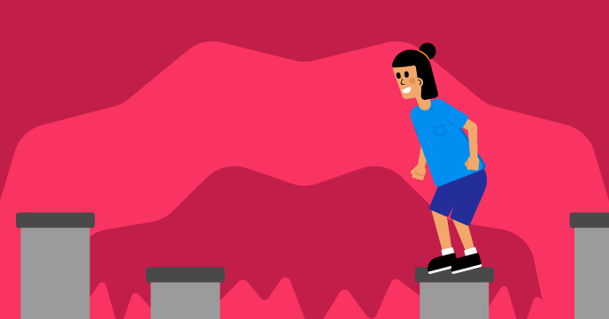

## Et ensuite ?

Si tu suis le parcours [Plus de Scratch](https://projects.raspberrypi.org/fr-FR/raspberrypi/more-scratch), tu peux passer au projet [Ne tombe pas dedans !](https://projects.raspberrypi.org/fr-FR/projects/dont-fall-in). Dans ce projet, tu vas créer un jeu qui défile de haut en bas où tu dois sauter de plateforme en plateforme et ne pas tomber dedans.

--- print-only ---

--- /print-only ---

--- no-print ---

  <iframe allowtransparency="true" width="485" height="402" src="https://scratch.mit.edu/projects/embed/525202210/?autostart=false" frameborder="0"></iframe>

**Instructions :** appuie sur la barre d'<kbd>espace</kbd> ou appuie sur la scène pour sauter.

--- /no-print ---

Si tu veux t'amuser davantage à explorer Scratch, tu peux essayer l'un de [ces projets](https://projects.raspberrypi.org/fr-FR/projects?software%5B%5D=scratch&curriculum%5B%5D=%201).

***
Ce projet a été traduit par des bénévoles:

Jonathan Vannieuwkerke
Michel Arnols

Grâce aux bénévoles, nous pouvons donner aux gens du monde entier la chance d'apprendre dans leur propre langue. Vous pouvez nous aider à atteindre plus de personnes en vous portant volontaire pour la traduction - plus d'informations sur [rpf.io/translate](https://rpf.io/translate).
