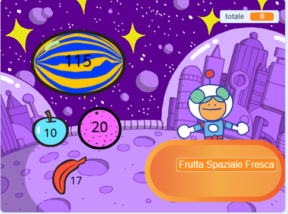
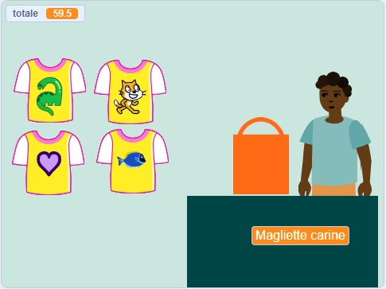
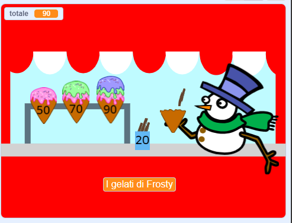
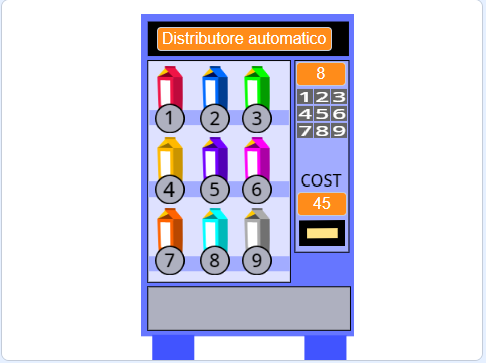

## Quello che farai

Crea un'app del tuo negozio, tramite il quale i clienti possono acquistare articoli. Il progetto sarà in prima persona e il giocatore sarà un cliente.

--- no-print ---

Gioca ▶️ Fai clic sulla frutta spaziale per acquistarla e guarda il totale aumentare. Quando sei pronto, clicca su Kiran per procedere al pagamento.

+ Cosa succede se provi a pagare prima di aver scelto un frutto?
+ Come pensi che il progetto sappia che non hai ancora aggiunto frutta?

**Frutta fresca dello spazio**: [Vedi all'interno](https://scratch.mit.edu/projects/528696418/editor){:target="_blank"}

  <iframe allowtransparency="true" width="485" height="402" src="https://scratch.mit.edu/projects/embed/528696418/?autostart=false" frameborder="0"></iframe>

### Lasciati ispirare 💭

Clicca sugli sprite del **venditore** per acquistare oggetti:

**Magliette fantastiche**: [Guarda dentro](https://scratch.mit.edu/projects/528697069/editor){:target="_blank"}

  <iframe allowtransparency="true" width="485" height="402" src="https://scratch.mit.edu/projects/embed/528697069/?autostart=false" frameborder="0"></iframe>

**Gelateria**: [Guarda dentro](https://scratch.mit.edu/projects/525972748/editor){:target="_blank"}

  <iframe allowtransparency="true" width="485" height="402" src="https://scratch.mit.edu/projects/embed/525972748/?autostart=false" frameborder="0"></iframe>

**⭐ Spille Pride** (progetto della comunità in evidenza)

Clicca sulle spille dell'orgoglio per aggiungerle al tuo carrello:

  <iframe allowtransparency="true" width="485" height="402" src="https://scratch.mit.edu/projects/embed/750787529/?autostart=false" frameborder="0"></iframe>

--- /no-print ---

--- print-only ---

### Lasciati ispirare 💭

Dovrai prendere alcune decisioni di progettazione per creare il tuo personaggio. Guarda gli esempi di progetti in Scratch 2: Prossimo cliente, per favore! Su Scratch al link https://scratch.mit.edu/studios/29611454

   

--- /print-only ---

