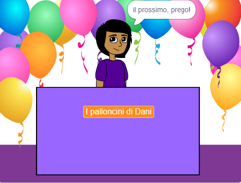

## Il tuo negozio

<div style="display: flex; flex-wrap: wrap">
<div style="flex-basis: 200px; flex-grow: 1; margin-right: 15px;">
Qual è l'idea del tuo negozio? Potrebbe essere qualcosa di realistico, qualcosa tratto da un libro o da un film che ti piace, o qualcosa di completamente sciocco.
</div>
<div>
{:width="300px"}
</div>
</div>

--- task ---

Apri un [nuovo progetto Scratch](http://rpf.io/scratch-new){:target="_blank"} e guarda la gamma di sprite e sfondi che puoi utilizzare. Prenditi del tempo per riflettere sulla tua idea di negozio.

--- /task ---

--- task ---

Fai clic su **Scegli uno sfondo** o dipingi il tuo sfondo.


+ Uno sfondo dalla libreria Scratch o uno sfondo colorato semplice

--- /task ---

--- task ---

Fai clic su **scegli uno sprite** e aggiungi o colora altri sprite dello scenario.


--- /task ---

--- task ---

Aggiungi altri scenari.
+ Una scrivania, un bancone o una finestra da cui vendere
+ Uno scaffale o una libreria su cui appoggiare gli oggetti - potresti dipingerlo sullo sfondo

--- /task ---

--- task ---

Aggiungi uno sprite per rappresentare il venditore.

Potresti scegliere:
+ Una persona o un personaggio non giocante, come un negoziante, un contadino o un bibliotecario
+ Un macchinario come un distributore automatico, un jukebox o un registratore di cassa


--- /task ---

### Dai il benvenuto al tuo primo cliente.

--- task ---

Fai clic sul tuo sprite venditore **** e aggiungi un blocco di trasmissione ``{:class="block3control"}. Crea un nuovo messaggio chiamato `prossimo cliente`.

```blocks3
when flag clicked
+ broadcast (next customer v)
```

--- /task ---

--- task ---

Crea un nuovo script per il tuo sprite **venditore** per `dire`{:class="block3looks"} `Prossimo cliente per favore` quando riceve la `trasmissione`{:class="block3control"} `prossimo cliente`{:class="block3control"}.

```blocks3
when I receive [next customer v] 
say [Next customer please!] for (2) seconds
```

--- /task ---

--- save ---
