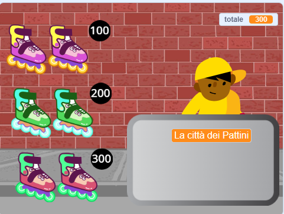
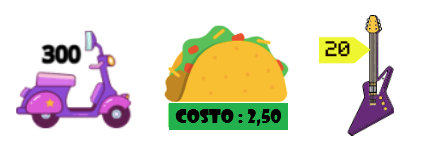

## Articoli in vendita

<div style="display: flex; flex-wrap: wrap">
<div style="flex-basis: 200px; flex-grow: 1; margin-right: 15px;">
Il tuo negozio ha bisogno di articoli da vendere. Ogni articolo avrà un prezzo che verrà aggiunto alla variabile `total`{:class="block3variables"}.
</div>
<div>
{:width="300px"}
</div>
</div>

Dovrai tenere traccia di quanto spende il tuo cliente.

--- task ---

Aggiungi una nuova variabile chiamata **total**{:class="block3variables"} per tutti gli sprite.

Fai clic sul tuo sprite **venditore** e aggiungi uno script a `imposta`{:class="block3variables"} il totale ``{:class="block3variables"} a `0` quando il progetto inizia.

[[[scratch3-create-set-variable]]]

--- /task ---

Quali **articoli** acquisteranno i tuoi clienti?
+ Un qualche tipo di cibo o bevanda
+ Attrezzature sportive, giocattoli o gadget
+ Bacchette magiche, pozioni o libri di incantesimi
+ Abbigliamento o altri articoli di moda
+ La tua idea

--- task ---

Aggiungi uno sprite per il primo **oggetto** che venderai nel tuo negozio.

Se vuoi, puoi aggiungere un prezzo al costume utilizzando lo strumento di testo nell'editor Paint. Oppure aggiungi un prezzo allo sfondo e posiziona l'articolo accanto.



--- /task ---

--- task ---

Aggiungi uno script per modificare `il valore di`{:class="block3variables"} nel totale ``{:class="block3variables"} in base al prezzo del tuo articolo quando il cliente clicca sullo sprite.

--- collapse ---
---
title: Clicca per aggiungere un elemento
---

```blocks3
when this sprite clicked
start sound (Coin v)
change [total v] by [10]
```

--- /collapse ---

È anche una buona idea `riprodurre un suono`{:class="block3sound"} per far sapere al cliente che ha aggiunto un articolo.


[[[scratch3-add-sound]]]

--- /task ---

--- task ---

**Test:** Fai clic sul tuo oggetto e controlla che il valore della variabile totale ``{:class="block3variables"} aumenti in base al prezzo dell'oggetto e che tu senta l'effetto sonoro. Clicca più volte per vedere aumentare il totale.

Fai clic sulla bandiera verde per avviare il progetto e assicurati che il totale ``{:class="block3variables"} inizi da `0`.

--- /task ---

--- task ---

Aggiungi altri articoli al tuo negozio.

Puoi:
+ Duplica il primo oggetto e poi aggiungi un nuovo costume nell'editor Paint
+ Aggiungi uno sprite e quindi trascina lo script `quando si fa clic sulla bandiera`{:class="block3events"} dal primo elemento al nuovo elemento

Se intendi utilizzarli, aggiungi un'etichetta con il prezzo al costume o allo sfondo.

--- /task ---

--- task ---

Fai clic sul tuo nuovo sprite **Oggetto** nell'elenco Sprite, quindi fai clic sulla scheda **Codice** .

Sostituisci l'importo di cui cambia il totale di ****{:class="block3variables"} con il prezzo del tuo nuovo articolo.

--- /task ---

--- task ---

**Test:** Fai clic sulla bandiera verde per avviare il progetto e fai clic sugli elementi per aggiungerli. Controlla che il totale aumenti dell'importo corretto ogni volta che clicchi su un elemento.

Se hai aggiunto etichette dei prezzi, assicurati che corrispondano all'importo che viene aggiunto al totale ``{:class="block3variables"}, altrimenti i tuoi clienti saranno confusi!

--- /task ---

--- task ---

**Debug:** Potresti trovare alcuni bug nel tuo progetto, che dovrai correggere. Ecco alcuni bug comuni.

--- collapse ---
---
title: Il totale non va a 0 quando clicco sulla bandiera verde
---

Verifica di aver impostato il valore iniziale della variabile `totale`{:class="block3variables"} nello script `quando si fa clic sulla bandiera`{:class="block3events"} sullo sprite **venditore**.

--- /collapse ---

--- collapse ---
---
tittle: Il totale non aumenta dell'importo corretto quando clicco su un elemento
---

Controlla che ogni oggetto abbia un valore `quando questo sprite è cliccato`{:class="block3events"} lo script modifica il totale ``{:class="block3variables"} della quantità corretta per quell'oggetto: potresti aver cambiato il prezzo per lo sprite sbagliato.

Verifica di aver utilizzato il blocco `modifica`{:class="block3variables"} e non il blocco `imposta`{:class="block3variables"} per modificare il totale ``{:class="block3variables"}. Devi usare `cambia`{:class="block3variables"} per aggiungere il prezzo al totale; non vuoi impostare il totale sul prezzo dell'articolo appena aggiunto.

--- /collapse ---

--- /task ---

--- save ---
