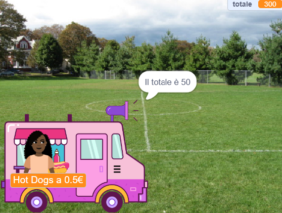

## Acquisti

<div style="display: flex; flex-wrap: wrap">
<div style="flex-basis: 200px; flex-grow: 1; margin-right: 15px;">

Lo sprite **venditore** deve:
- chiedere se il cliente è pronto a pagare gli articoli
- accettare il pagamento
- prepararsi per il prossimo cliente
</div>
<div>
{:width="300px"}
</div>
</div>

Una volta terminata la scelta degli articoli, il cliente cliccherà sullo sprite **venditore** per pagare.

--- task ---

 Comunica al cliente quanto costeranno i suoi articoli.

```blocks3
when this sprite clicked
say (join [Il totale è ] (totale)) for (2) seconds 
```

--- /task ---

--- task ---

Aggiungi un suono di pagamento al tuo sprite **venditore** in modo che il cliente sappia che il pagamento è in corso.


[[[scratch3-add-sound]]]

Aggiungi il blocco `riproduci suono finché non viene completato`{:class="block3sound"} al tuo script.

```blocks3
when this sprite clicked
say (join [Il totale è ] (totale)) for (2) seconds
+ play sound [machine v] until done 
```

--- /task ---

--- task ---

Concludi la vendita. Ripristina `il totale`{:class="block3variables"} a `0` dopo il pagamento, `saluta`{:class="block3looks"} e `trasmetti`{:class="block3control"} `il prossimo cliente`{:class="block3control"}.

```blocks3
when this sprite clicked
say (join [Il totale è ] (totale)) for (2) seconds
play sound [machine v] until done 
+ set [totale v] to (0)
+ say (join [Grazie per aver fatto acquisti ] (nome)) for (2) seconds
+ broadcast (prossimo cliente v)
```

--- /task ---

--- task ---

**Test:** Prova il tuo progetto e assicurati che:
- Il cliente può effettuare il check-out con gli effetti sonori corretti
- Il `totale`{:class="block3variables"} di viene riportato a `0` dopo che un cliente paga o annulla.

--- /task ---


--- task ---

**Debug:** Potresti trovare alcuni bug nel tuo progetto, che dovrai correggere.

Ecco alcuni bug comuni:

--- collapse ---
---
title: Il venditore non fa nulla quando clicco su di lui
---

Hai un bel po' di sprite nel tuo progetto. Assicurati che lo script `quando questo sprite è cliccato`{:class="block3events"} sia sul tuo sprite **venditore**.

**Suggerimento:** Se l'hai aggiunto allo sprite sbagliato, puoi trascinare il codice nello sprite del **venditore** , quindi eliminarlo dall'altro sprite.

--- /collapse ---

--- collapse ---
---
title: Le parole nei blocchi dire si fondono insieme
---

Quando `unisci`{:class="block3operators"} due pezzi insieme, devi aggiungere uno spazio alla fine del primo pezzo di testo o all'inizio del secondo pezzo di testo.

Questi hanno uno spazio alla fine della prima parte dell'unione:

```blocks3
say {join [Il totale è ](totale)} for (2) seconds

say {join [Grazie per aver fatto acquisti ](nome)} for (2) seconds
```

--- /collapse ---

--- collapse ---
---
title: Il totale non si azzera dopo una vendita
---

Controlla di aver utilizzato:

```blocks3
set [totale v] to (0)
```

**non**:

```blocks3
change [totale v] by (0)
```

--- /collapse ---

--- collapse ---
---
title: Il venditore non risponde
---

Assicurati che `l'operatore`{:class="block3operators"} nella condizione `se`{:class="block3control"} sia il simbolo maggiore di `>`{:class="block3operators"}.

```blocks3
if <(totale) > [0]> then
```

--- /collapse ---

**Suggerimento:** Confronta il tuo codice con gli esempi di codice. Ci sono differenze che non dovrebbero esserci?

--- /task ---

--- save ---
