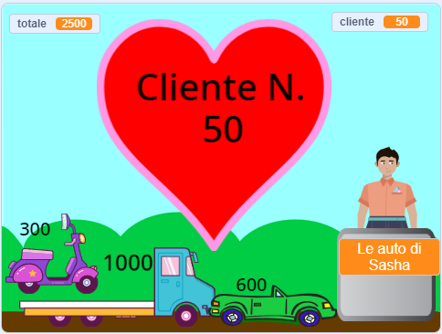

## Sfida

<div style="display: flex; flex-wrap: wrap">
<div style="flex-basis: 200px; flex-grow: 1; margin-right: 15px;">
Sono tante le funzionalità che potresti aggiungere per migliorare l'esperienza di acquisto dei tuoi clienti. Non è necessario aggiungere tutto. Aggiungi semplicemente i miglioramenti che ritieni importanti.
</div>
<div>
{:width="300px"}
</div>
</div>

--- task ---

Aggiungi altri articoli da vendere.

--- /task ---

--- task ---

Aggiungi musica ed effetti sonori.

--- /task ---

--- task ---

Dipingi il tuo scenario e altri costumi.

--- /task ---

--- task ---

Crea un'altra attività e consenti ai giocatori di visitarle entrambe.

--- /task ---

Ogni progetto di esempio nell'[Introduzione](.) ha un collegamento "Guarda all'interno" che ti consente di aprire il progetto in Scratch e di guardare il codice per prendere spunto e vedere come funziona. Puoi "Guardare all'interno" dei progetti di esempio per vedere come funzionano.

Progetti di esempio:
**Frutta fresca spaziale**: [Guarda all'interno](https://scratch.mit.edu/projects/1111488970/editor){:target="_blank"}
**Magliette fantastiche**: [Guarda all'interno](https://scratch.mit.edu/projects/1111480198/editor){:target="_blank"}
**Gelateria**: [Guarda all'interno](https://scratch.mit.edu/projects/1111490570/editor){:target="_blank"}
**Distributore automatico**: [Guarda all'interno](https://scratch.mit.edu/projects/526051796/editor){:target="_blank"}

**Suggerimento:** se hai effettuato l'accesso a un account Scratch, puoi usare il **Backpack** per copiare script o sprite nel tuo progetto.

[[[scratch-backpack]]]

### Paga, chiacchierone!

Il cassiere (o la cassa automatica) potrebbe chiedere se il servizio è stato buono o se il cliente sta avendo una bella giornata.

--- task ---

Puoi aggiungere blocchi `chiedi`{:class="block3sensing"} allo script del tuo **venditore** `quando si clicca questo sprite`{:class="block3events"} e `dire`{:class="block3looks"} cose diverse a seconda della risposta del cliente.

--- collapse ---

---

title: Fai e rispondi alle domande

---

```blocks3
ask [Hai trovato tutto quello che volevi oggi?] and wait
if <(answer) = [sì]> then
say [È fantastico!] for [2] seconds
else
say [Forse dovrei aggiungere più articoli al mio negozio] for [2] seconds
end
```

**Debug:** controlla di aver scritto correttamente le opzioni nel tuo codice e nella tua risposta. Va bene anche usare le lettere maiuscole, quindi "Sì" e "SÌ" corrisponderanno a "sì".

Aggiungi più domande per creare un chatbot o un personaggio non giocante con cui puoi parlare.

--- /collapse ---

--- /task ---

### Metti gli oggetti in un sacchetto

--- task ---

Il progetto "Magliette fantastiche" propone magliette che scivolano in una borsa.

--- collapse ---

---

title: Fai scivolare gli oggetti in un contenitore

---

Aggiungere uno sprite **Contenitore**. Potresti usare uno sprite esistente come **Gift** o **Take out**, oppure colorarne uno tuo con forme semplici.

Aggiungi uno script per far sì che il contenitore **** appaia sempre in primo piano:

```blocks3
when flag clicked
forever
go to [primo v] layer
end
```

Quindi dovrai aggiungere del codice a ciascun **oggetto** in vendita per farli scivolare verso il contenitore quando vengono cliccati:

```blocks3
when this sprite clicked
+go to [primo v] layer
+glide [1] secs to (Bag v) // usa il nome del tuo contenitore sprite 
+hide
change [totale v] by [12]
+go to x: [-180] y: [68] // posizione iniziale
+show
```

Se non vuoi che il contenitore sia sempre presente, puoi aggiungere degli script per visualizzarlo e nasconderlo al momento giusto:

```blocks3
when I receive [prossimo cliente v]
hide // il cliente precedente prende la borsa
wait [1] seconds
show
```

**Test:** Prova il tuo progetto e assicurati che gli oggetti scivolino verso il contenitore e si nascondano.

**Debug:** Controlla attentamente i tuoi script e assicurati di aver aggiornato tutti i tuoi **sprite degli oggetti**. Se hai bisogno di un esempio funzionante, puoi dare un'occhiata a [Magliette fantastiche](https://scratch.mit.edu/projects/1111480198/editor){:target="_blank"}.

--- /collapse ---

--- /task ---

###  Interrompi l'aggiunta di articoli quando il cliente è alla cassa

--- task ---

Aggiungi una variabile `negozio`{:class="block3variables"} e usala per controllare quando possono essere aggiunti gli articoli.

--- collapse ---

---
title: Consenti gli acquisti solo quando il cliente non è alla cassa

---

Aggiungi una `variabile`{:class="block3variables"} chiamata `negozio` per tutti gli sprite. Imposterai questo valore su **vero** quando il cliente è nel negozio e su `falso` quando è alla cassa.

Seleziona il tuo sprite **venditore**. Aggiorna lo script `quando si fa clic sulla bandiera`{:class="block3events"} per consentire lo shopping all'avvio del progetto:

```blocks3
+set [negozio v] to [vero]
```

Ora aggiungi un blocco per modificare il negozio ``{:class="block3variables"} in`falso`all'inizio dello script del tuo **venditore**`quando si clicca sprite`{:class="block3events"}:

```blocks3 
+set [negozio v] to [falso]
```

E un blocco per impostare la variabile `negozio`{:class="block3variables"} di nuovo su `vero` alla fine dello stesso script:

```blocks3 
+set [negozio v] to [vero]
```

Ora devi aggiornare gli oggetti che vendi per controllare la variabile del `negozio`{:class="block3variables"}:

```blocks3
when this sprite clicked
+if <(negozio) = [vero]> then
start sound (Coin v)
change [totale v] by [10]
end
```
Dovrai fare questa operazione per ogni articolo che vendi nel tuo negozio.

**Test:** Fai clic sulla bandiera verde, quindi prova a fare acquisti. Verifica che sia ancora possibile aggiungere articoli e procedere al pagamento, ma che non sia possibile aggiungere articoli una volta avviato il pagamento.

**Debug:** Controlla il tuo codice molto attentamente. Se hai bisogno di vedere un esempio funzionante, puoi dare un'occhiata al progetto [Frutta fresca spaziale](https://scratch.mit.edu/projects/1111488970/editor){:target="_blank"}.

--- /collapse ---

--- /task ---

--- task ---

### Potresti dare al cliente la possibilità di annullare l'acquisto.

--- collapse ---
---
title: Imposta le opzioni di pagamento e annullamento
---

`Chiedi`{:class="block3sensing"} `Vuoi pagare o annullare?`. Aggiungi un blocco `Se`{:class="block3control"} per `rispondi`{:class="block3sensing"} `=`{:class="block3operators"} `paga` e al suo interno inserisci i tuoi blocchi di pagamento esistenti.

```blocks3
when this sprite clicked
say (join [Il totale è ] (totale)) for (2) seconds
+ ask [Vuoi pagare o annullare?] and wait
+ if {(answer) = [paga]} then
play sound [machine v] until done 
set [totale v] to (0)
say (join [Grazie per aver fatto acquisti ] (nome)) for (2) seconds
broadcast [prossimo cliente v]
end
```

Aggiungi un secondo blocco `Se`{:class="block3control"} per `rispondi`{:class="block3sensing"} `=`{:class="block3operators"} `annulla` e al suo interno aggiungi il codice per annullare l'ordine.

```blocks3
when this sprite clicked
say (join [Il totale è ] (totale)) for (2) seconds
ask [Vuoi pagare o annullare?] and wait
if {(answer) = [paga]} then
play sound [machine v] until done 
set [totale v] to (0)
say (join [Grazie per aver fatto acquisti ] (nome)) for (2) seconds
broadcast [prossimo cliente v]
end
+ if {(answer) = [annulla]} then
set [totale v] to (0)
say [Ok. Nessun problema] for (2) seconds
broadcast [prossimo cliente v]
end
```

--- /collapse ---

--- /task ---

Dai un'occhiata al nostro ['Mercato dello shopping intergalattico'](https://scratch.mit.edu/studios/29662180){:target="_blank"} studio Scratch per vedere i progetti creati dai membri della community.

--- save ---
