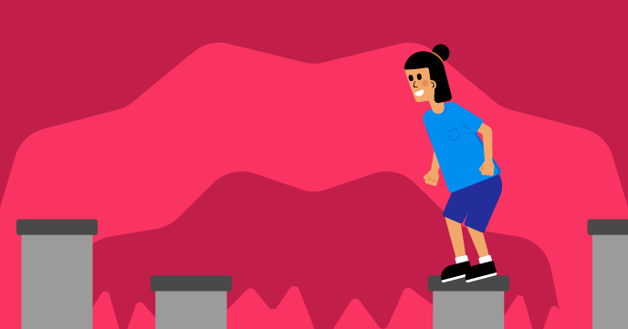

## E adesso?

Se stai seguendo il percorso [Più Scratch](https://projects.raspberrypi.org/en/raspberrypi/more-scratch), puoi passare al progetto [Non caderci](https://projects.raspberrypi.org/en/projects/dont-fall-in). In questo progetto, creerai un gioco dall'alto verso il basso in cui dovrai saltare da una piattaforma all'altra senza caderci dentro.

--- print-only ---

--- /print-only ---

--- no-print ---

  <iframe allowtransparency="true" width="485" height="402" src="https://scratch.mit.edu/projects/embed/525202210/?autostart=false" frameborder="0"></iframe>

**Istruzioni:** Premi <kbd>spazio</kbd> o tocca il palco per saltare.

--- /no-print ---

Se vuoi divertirti di più esplorando Scratch, puoi provare uno qualsiasi di [questi progetti](https://projects.raspberrypi.org/en/projects?software%5B%5D=scratch&curriculum%5B%5D=%201).
