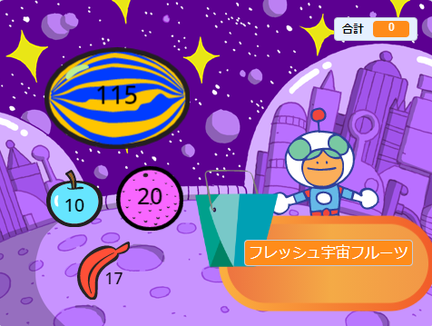
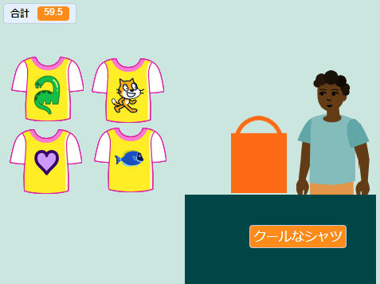
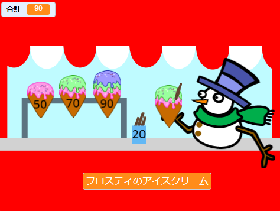
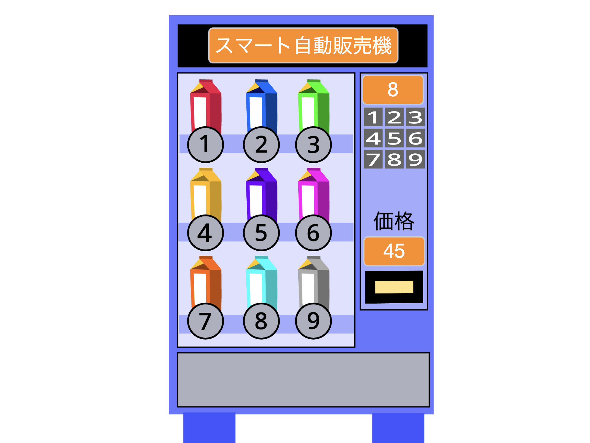

## 作るもの

お客さんがあなたのお店の商品を購入できるお店アプリを作りましょう。 このプロジェクトでは、プレイヤーがお客として一人称の視点でプレイします。

--- no-print ---

宇宙のフルーツをクリックして合計額が増えるのを確認します。 準備ができたら、キランをクリックしてお会計します。

+ フルーツを選ぶ前にお会計をしようとするとどうなりますか？
+ まだフルーツを追加していないことを、プロジェクトはどうして分かると思いますか？

**フレッシュ宇宙フルーツ**: [中を見る](https://scratch.mit.edu/projects/1306856395/editor){:target="_blank"}

  <iframe allowtransparency="true" width="485" height="402" src="https://scratch.mit.edu/projects/embed/1306856395/?autostart=false" frameborder="0"></iframe>

### アイデアを得る 💭

以下の**店員**のスプライトをクリックして商品を買ってみてください。

**クールなシャツ**: [中を見る](https://scratch.mit.edu/projects/1306862558/editor){:target="_blank"}

  <iframe allowtransparency="true" width="485" height="402" src="https://scratch.mit.edu/projects/embed/1306862558/?autostart=false" frameborder="0"></iframe>

**アイスクリームショップ**: [中を見る](https://scratch.mit.edu/projects/1306864050/editor){:target="_blank"}

  <iframe allowtransparency="true" width="485" height="402" src="https://scratch.mit.edu/projects/embed/1306864050/?autostart=false" frameborder="0"></iframe>

**⭐プライドピン**（注目のコミュニティプロジェクト）

プライドピンバッジをクリックして買い物袋に追加しましょう。

  <iframe allowtransparency="true" width="485" height="402" src="https://scratch.mit.edu/projects/embed/750787529/?autostart=false" frameborder="0"></iframe>

--- /no-print ---

--- print-only ---

### アイデアを得る 💭

キャラクターを作成するためにデザインを決めましょう。 Scratch 2の「次のお客様どうぞ！」のサンプルプロジェクトを見てください。 Scratchスタジオは https://scratch.mit.edu/studios/29611454

--- /print-only ---

