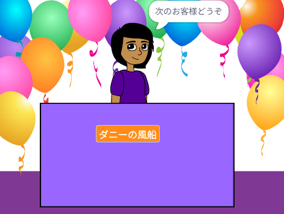

## あなたのお店

<div style="display: flex; flex-wrap: wrap">
<div style="flex-basis: 200px; flex-grow: 1; margin-right: 15px;">
どんなお店にしますか？ 実際にあるものでも、好きな本や映画からでも、完全にふざけたものでも何でもOK。
</div>
<div>
{:width="300px"}
</div>
</div>

--- task ---

[新しいScratchプロジェクト](http://rpf.io/scratch-new){:target="_blank"}を開いて使用できるスプライトや背景を見てみてください。 お店のアイデアについてじっくり考えてみましょう。

--- /task ---

--- task ---

**背景を選ぶ**か自分で背景を描きます。


+ Scratchライブラリの背景、または単色の背景

--- /task ---

--- task ---

**スプライトをひとつ選んで**、他に風景になるスプライトを加えるか描きます。


--- /task ---

--- task ---

風景をもっと追加します。
+ 販売用の机、カウンター、窓口
+ 商品を置く棚や本箱（背景に書いてしまってもよいです）

--- /task ---

--- task ---

店員を表すスプライトを追加します。

例えば
+ 店主、農夫、司書のような人物またはノンプレイヤーキャラクター
+ 自動販売機、ジュークボックス、レジなどの機械


--- /task ---

### 初めて来たお客さんを歓迎します。

--- task ---

**店員**のスプライトをクリックし、`送る`{:class="block3events"}ブロックを追加します。 `次のお客`という新しいメッセージを作成します。

```blocks3
when flag clicked
+ broadcast (next customer v)
```

--- /task ---

--- task ---

**店員**のスプライトに新しいスクリプトを作成して、`次のお客`{:class="block3control"}を`受け取ったとき`{:class="block3events"}に、`次のお客様どうぞ`と`言う`{:class="block3looks"}ようにします。

```blocks3
when I receive [next customer v] 
say [Next customer please!] for (2) seconds
```

--- /task ---

--- save ---
