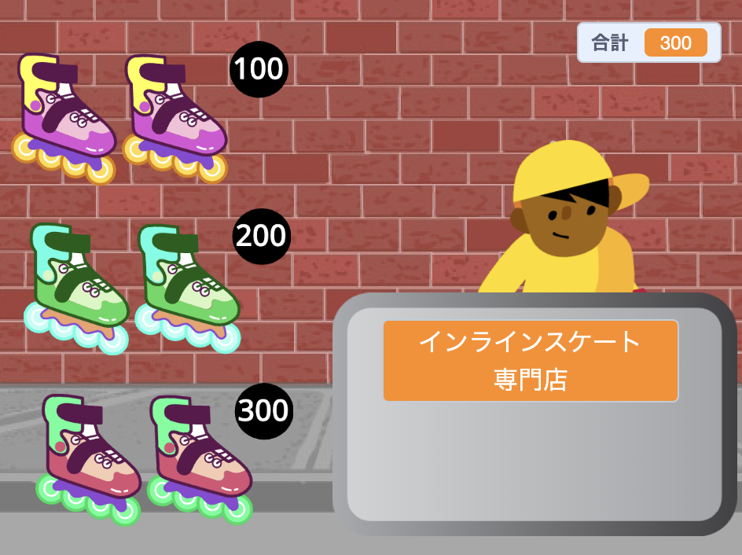
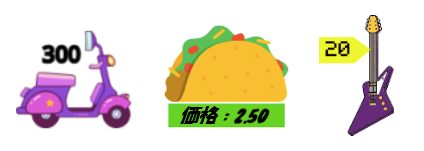

## 販売する商品

<div style="display: flex; flex-wrap: wrap">
<div style="flex-basis: 200px; flex-grow: 1; margin-right: 15px;">
あなたのお店には販売する商品が必要です。 各商品には価格があり、それが`合計`{:class="block3variables"}変数に追加されます。
</div>
<div>
{:width="300px"}
</div>
</div>

お客さんがいくら使ったか追跡する必要があります。

--- task ---

`合計`{:class="block3variables"}という名前で、すべてのスプライト用の新しい変数を追加します。

**店員**のスプライトをクリックして、プロジェクトが開始されたときに`合計`{:class="block3variables"}を`0`に`する`スクリプトを追加します。

[[[scratch3-create-set-variable]]]

--- /task ---

お客さんはどんな**商品**を購入するでしょうか？
+ 何かの食べ物や飲み物
+ スポーツ用品、おもちゃ、ガジェット
+ 魔法の杖、魔法薬、呪文書
+ 衣類やその他のファッションアイテム
+ あなた自身のアイデア

--- task ---

お店で販売する最初の**商品**のスプライトを追加します。

必要に応じて、ペイントエディターのテキストツールを使用してコスチュームに価格を追加できます。 あるいは、背景に価格を追加し、その横に商品を配置します。



--- /task ---

--- task ---

お客さんがスプライトをクリックしたときに、`合計`{:class="block3variables"}を商品の価格`ずつ変える`{:class="block3variables"}スクリプトを追加します。

--- collapse ---
---
title: クリックして商品を追加する
---

```blocks3
when this sprite clicked
start sound (Coin v)
change [合計 v] by [10]
```

--- /collapse ---

お客さんが商品を追加したことがわかるように`音を鳴らす`{:class="block3sound"}のもお勧めです。


[[[scratch3-add-sound]]]

--- /task ---

--- task ---

**テスト:** 商品をクリックして、`合計`{:class="block3variables"}変数の値が商品の価格分増加し、効果音が聞こえることを確認します。 更にクリックして合計が増加するのを確認します。

緑の旗をクリックしてプロジェクトを開始すると、`合計`{:class="block3variables"}は`0`から始まることを確認します。

--- /task ---

--- task ---

お店にもっと商品を追加します。

次のどちらかのようにできます。
+ 最初の商品を複製して、ペイントエディターで新しいコスチュームを追加する
+ スプライトを追加して、最初の商品の`緑の旗が押されたとき`{:class="block3events"}スクリプトを新しい商品へドラッグする

追加したスプライトを使用する場合は、コスチュームや背景に価格のラベルを追加します。

--- /task ---

--- task ---

スプライト一覧の新しい**商品**スプライトをクリックし、次に**コード**タブをクリックします。

新しい商品の価格の分だけ`合計`{:class="block3variables"}が変化する金額を変更します。

--- /task ---

--- task ---

**テスト:** 緑の旗を押してプロジェクトを開始し、商品をクリックして追加します。 商品をクリックするたびに合計が正しい金額の分だけ増加することを確認します。

価格ラベルを追加した場合は、`合計`{:class="block3variables"}に追加される金額と一致していることを確認してください。一致していないと、お客さんが混乱してしまいます！

--- /task ---

--- task ---

**デバッグ:** プロジェクトに修正する必要のあるバグが見つかる場合があります。 一般的なバグは次のとおりです。

--- collapse ---
---
title: 緑の旗を押しても合計が0にならない
---

**店員**スプライトの`緑の旗が押されたとき`{:class="block3events"}スクリプトで`合計`{:class="block3variables"}変数の初期値を設定していることを確認します。

--- /collapse ---

--- collapse ---
---
title: 商品をクリックしたときに正しい金額で合計が増加しません
---

それぞれの商品が、`合計`{:class="block3variables"}を正しい金額の分だけ変更する`このスプライトが押されたとき`{:class="block3events"}スクリプトを持っていることを確認します。間違ったスプライトの価格を変更しているかもしれません。

`合計`{:class="block3variables"}を変更するのに、`ずつ変える`{:class="block3variables"}ブロックを使用していて、`にする`{:class="block3variables"}ブロックを使用していないことを確認します。 価格を合計に追加するには、 `ずつ変える`{:class="block3variables"}を使う必要があります。今追加された商品の価格をそのまま合計に設定したくはありません。

--- /collapse ---

--- /task ---

--- save ---
