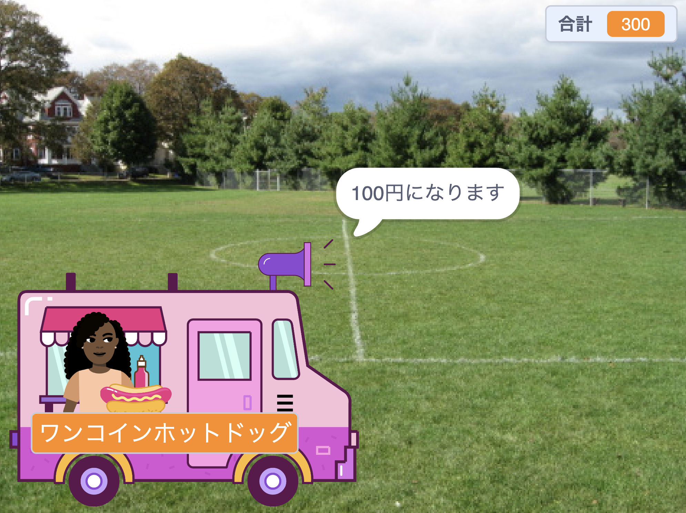

## 買う

<div style="display: flex; flex-wrap: wrap">
<div style="flex-basis: 200px; flex-grow: 1; margin-right: 15px;">

**店員**スプライトは次の操作を行う必要があります
- お客さんに商品代金を支払うか確認する
- 支払いを受ける
- 次のお客さんの準備する
</div>
<div>
{:width="300px"}
</div>
</div>

商品を選び終わったら、お客さんは支払いに進むために**店員**スプライトをクリックします。

--- task ---

 お客さんに商品の価格を伝えます。

```blocks3
when this sprite clicked
say (join [That will be ] (total)) for (2) seconds 
```

--- /task ---

--- task ---

お客さんに支払いが行われていることを知らせるために、**店員**スプライトに支払いの音を追加します。


[[[scratch3-add-sound]]]

スクリプトに`終わるまで音を鳴らす`{:class="block3sound"}ブロックを追加します。

```blocks3
when this sprite clicked
say (join [That will be ] (total)) for (2) seconds
+ play sound [machine v] until done 
```

--- /task ---

--- task ---

販売を完了します。 支払いの後、`合計`{:class="block3variables"}を`0`に戻して、さよならを`言って`{:class="block3looks"}、`次のお客`{:class="block3control"}を`送り`{:class="block3control"}ます。

```blocks3
when this sprite clicked
say (join [That will be ] (total)) for (2) seconds
play sound [machine v] until done 
+ set [total v] to (0)
+ say (join [Thanks for shopping at ] (name)) for (2) seconds
+ broadcast (next customer v)
```

--- /task ---

--- task ---

**テスト:** プロジェクトをテストして次のことを確認します。
- お客さんがお会計するときに正しい効果音が鳴る
- お客さんが支払いを済ませるかキャンセルすると`合計`{:class="block3variables"}が`0`に戻る。

--- /task ---


--- task ---

**デバッグ:** プロジェクトに修正する必要のあるバグが見つかる場合があります。

よくあるバグをいくつか紹介します。

--- collapse ---
---
title: 店員をクリックしても何もしてくれない
---

プロジェクトにはとても多くのスプライトがあります。 `このスプライトが押されたとき`{:class="block3events"}スクリプトが**店員**スプライトにあることを確認してください。

**ヒント:** 間違ったスプライトに追加していた場合は、コードを**店員**スプライトにドラッグしてから、他のスプライトにあるコードを削除します。

--- /collapse ---

--- collapse ---
---
title: 言うブロックのテキストがくっついちゃう
---

2つのテキストを`～と～`{:class="block3operators"}でつなげるとき、最初のテキストの末尾か2番目のテキストの先頭に空白を追加する必要があります。（訳注: 英語の場合、単語と単語の間に空白を置かないと2つの単語がくっついてしまいます）

この例では、いずれも1つ目の末尾に空白があります。

```blocks3
say {join [That will be ](total)} for (2) seconds

say {join [Thanks for shopping at ](name)} for (2) seconds
```

--- /collapse ---

--- collapse ---
---
title: 売れた後に合計がリセットされない
---

次のようになっていることを確認します。

```blocks3
set [total v] to (0)
```

**次ではありません**

```blocks3
change [total v] by (0)
```

--- /collapse ---

--- collapse ---
---
title: 店員が応答しない
---

`もし`{:class="block3control"}条件の`演算子`{:class="block3operators"}が、大なり記号`>`{:class="block3operators"}であることを確認します。

```blocks3
if <(total) > [0]> then
```

--- /collapse ---

**ヒント:** 自分のコードをコード例と比較してください。 あるとまずい違いが何かありますか？

--- /task ---

--- save ---
