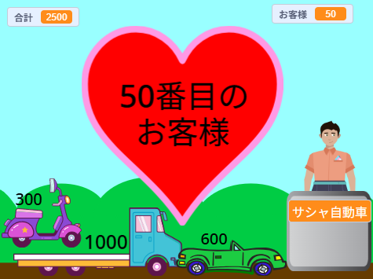

## チャレンジ

<div style="display: flex; flex-wrap: wrap">
<div style="flex-basis: 200px; flex-grow: 1; margin-right: 15px;">
お客さんのショッピング体験を向上できる追加機能が数多くあります。 すべてを追加する必要はありません。 重要だと思う改善点だけを追加してください。
</div>
<div>
{:width="300px"}
</div>
</div>

--- task ---

もっと販売する商品を追加する。

--- /task ---

--- task ---

グラフィックや効果音を追加する。

--- /task ---

--- task ---

風景や追加のコスチュームを自分で描く。

--- /task ---

--- task ---

もう一つ別のビジネスを作って、プレイヤーが両方に行けるようにする。

--- /task ---

[はじめに](.)の各サンプルプロジェクトには「中を見る」リンクがあり、Scratchでプロジェクトを開いてコードを見ることによりアイデアを得たり、プロジェクトがどのように動作するのか確認できるようになっています。 サンプルプロジェクトの「中を見る」でどのように動作するのか確認できます。

サンプルプロジェクト
**フレッシュ宇宙フルーツ**: [中を見る](https://scratch.mit.edu/projects/1306856395/editor){:target="_blank"}
**クールなシャツ**: [中を見る](https://scratch.mit.edu/projects/1306862558/editor){:target="_blank"}
**アイスクリームショップ**: [中を見る](https://scratch.mit.edu/projects/1306864050/editor){:target="_blank"}
**自動販売機**: [中を見る](https://scratch.mit.edu/projects/1306865419/editor){:target="_blank"}

**ヒント:** Scratchアカウントにログインしている場合は、**バックパック**を使用してスクリプトやスプライトをあなたのプロジェクトにコピーできます。

[[[scratch-backpack]]]

### おしゃべりなレジ！

レジ係（またはレジの機械）にサービスがよかったかどうか、あるいはお客さんがよい一日を過ごしているかどうか尋ねさせることができます。

--- task ---

`聞く`{:class="block3sensing"}ブロックを**店員**の`このスプライトが押されたとき`{:class="block3events"}スクリプトに追加して、お客さんの返答に応じたさまざまなことを`言わせ`{:class="block3looks"}ます。

--- collapse ---

---
title: 質問して答える
---

```blocks3
ask [今日欲しいものはすべて見つかりましたか？] and wait
if <(answer) = [はい]> then
say [よかったです！] for [2] seconds
else
say [お店に商品をもっと追加する必要がありそうですね] for [2] seconds
end
```

**デバッグ:** コードと答えに書いたオプションが正しく書かれていることを確認してください。 オプションを英語にする場合、大文字と小文字の区別はないので、"Yes"と"YES"は"yes"に一致します。

複数の質問を追加して、会話ができるチャットボットやノンプレイヤーキャラクターを作りましょう。

--- /collapse ---

--- /task ---

### 商品を買い物袋に入れる

--- task ---

「クールなシャツ」プロジェクトではシャツを買い物袋に入れます。

--- collapse ---

---
title: 商品を入れ物に入れる
---

**入れ物**スプライトを追加します。 **Gift**や**Takeout**スプライトなどの既存のスプライトを使用したり、単純な形の独自のスプライトを描くこともできます。

スクリプトを追加して**入れ物**が常に最前面に表示されるようにします。

```blocks3
when flag clicked
forever
go to [最前面 v] layer
end
```

次に、クリックされたら入れ物へ移動するように、販売する各**商品**にコードを追加する必要があります。

```blocks3
when this sprite clicked
+go to [最前面 v] layer
+glide [1] secs to (Bag v) // コンテナスプライトの名前を使用する
+hide
change [合計 v] by [12]
+go to x: [-180] y: [68] // 開始位置
+show
```

入れ物を常に表示しておく必要がない場合は、スクリプトを追加して、適切なタイミングで入れ物を表示したり隠したりできます。

```blocks3
when I receive [次のお客 v]
hide // 前のお客が買い物袋を受け取る
wait [1] seconds
show
```

**テスト:** プロジェクトを試してみて、商品が入れ物に移動し、非表示になることを確認します。

**デバッグ:** スクリプトを注意深く確認し、すべての**商品**スプライトが更新されていることを確認してください。 実際の例を確認する必要がある場合は、[クールなシャツ](https://scratch.mit.edu/projects/1306862558/editor){:target="_blank"}を参照してください。

--- /collapse ---

--- /task ---

###  お客さんがレジにいたら商品を追加できなくする

--- task ---

`買い物`{:class="block3variables"}変数を追加し、それを使用して商品を追加できるタイミングを制御します。

--- collapse ---

---
title: お客さんがレジにいたら購入できなくする
---

`買い物`という名前ですべてのスプライト用の`変数`{:class="block3variables"}を追加します。 お客さんが店内にいるときにはこれを`true`に設定し、レジにいるときには`false`に設定します。

**店員**スプライトを選択してください。 プロジェクトの開始時に買い物できるようにするには、`緑の旗が押されたとき`{:class="block3events"}スクリプトを更新します。

```blocks3
+set [買い物 v] to [true]
```

ここで、**店員**の`このスプライトが押されたとき`{:class="block3events"}スクリプトの先頭に、`買い物`{:class="block3variables"}を`false`に変更するブロックを追加します。

```blocks3 
+set [買い物 v] to [false]
```

そして、同じスクリプトの最後に、`買い物`{:class="block3variables"}変数を`true`に戻すブロックを追加します。

```blocks3 
+set [買い物 v] to [true]
```

ここで、販売する商品を更新して、`買い物`{:class="block3variables"}変数を確認する必要があります。

```blocks3
when this sprite clicked
+if <(買い物) = [true]> then
start sound (Coin v)
change [合計 v] by [10]
end
```
お店で販売するすべての商品に対してこれを行う必要があります。

**テスト:** 緑の旗をクリックして買い物してみましょう。 商品を追加してお会計することは引き続きできても、お会計を開始したら商品が追加できないことを確認します。

**デバッグ:** コードを慎重にチェックしてください。 実際の例を確認する必要がある場合は、[宇宙フルーツ](https://scratch.mit.edu/projects/1306856395/editor){:target="_blank"}プロジェクトを参照してください。

--- /collapse ---

--- /task ---

--- task ---

### お客さんに買い物をキャンセルするオプションを提供します。

--- collapse ---

---
title: 支払いとキャンセルのオプションを設定する
---

`支払いますか、それともキャンセルしますか？`と`聞いて待ち　ます`{:class="block3sensing"}。 `答え`{:class="block3sensing"} `=`{:class="block3operators"} `支払い`を調べる`もし～なら`{:class="block3control"}ブロックを追加して、その中に既にある支払いブロックを配置します。

```blocks3
when this sprite clicked
say (join [全部で] (合計)) for (2) seconds
+ ask [「支払い」ますか？それとも「キャンセル」しますか？] and wait
+ if {(answer) = [支払い]} then
play sound [machine v] until done 
set [合計 v] to (0)
say (join (名前)[でお買い上げありがとうございます]) for (2) seconds
broadcast [次のお客 v]
end
```

`答え`{:class="block3sensing"} `=`{:class="block3operators"} `キャンセル`を調べる2つ目の`もし～なら`{:class="block3control"}ブロックを追加して、その中に注文をキャンセルするブロックを追加します。

```blocks3
when this sprite clicked
say (join [That will be ] (合計)) for (2) seconds
ask [「支払い」ますか？それとも「キャンセル」しますか？] and wait
if {(answer) = [支払い]} then
play sound [machine v] until done 
set [合計 v] to (0)
say (join (名前)[でお買い上げありがとうございます]) for (2) seconds
broadcast [次のお客 v]
end
+ if {(answer) = [キャンセル]} then
set [合計 v] to (0)
say [わかりました。問題ございません] for (2) seconds
broadcast [次のお客 v]
end
```

--- /collapse ---

--- /task ---

[「銀河系ショッピング マーケット」](https://scratch.mit.edu/studios/29662180){:target="_blank"}Scratchスタジオにある、コミュニティメンバーが作成したプロジェクトをご覧ください。

--- save ---
