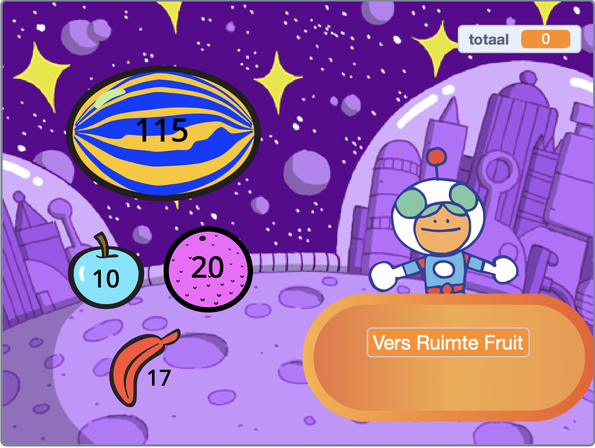
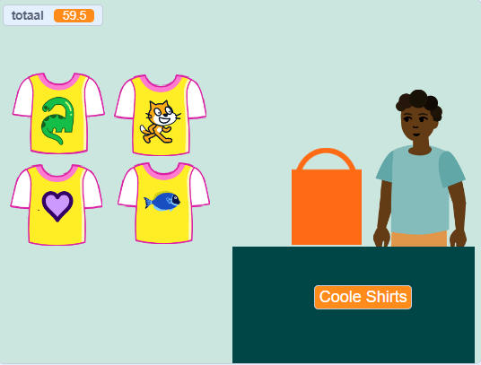
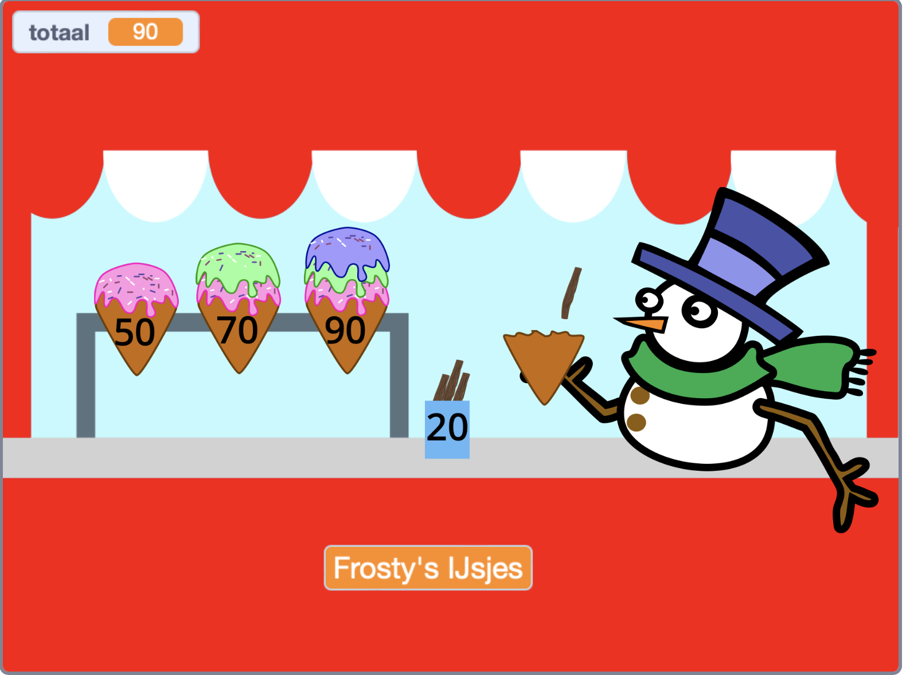
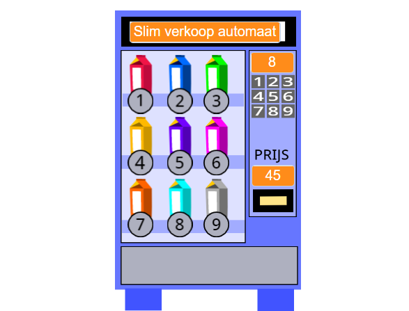

## You will make

Maak een winkel-app waar de klant producten in je winkel kan kopen. Het project zal in de ik-persoon weergave zijn waar de speler een klant is.

**ik-persoon weergave** betekent dat je je personage niet op het scherm ziet, maar dat je ziet wat ze zien.

Je gaat:
+ Een winkel app maken met producten om te kopen en een kassa
+ Je tijd goed plannen om een eenvoudige versie snel te laten werken
+ Winkels van anderen proberen en je eigen winkel delen zodat anderen hem kunnen proberen

--- no-print ---

--- task ---

  

### Play ▶️ 

Click on Space Fruit to buy them and watch the total go up. Als je klaar bent, klik je op Kiran om uit te checken. 

+ wat gebeurt er als je probeert uit te checken voordat je fruit hebt gekozen? 
+ Hoe denk je dat het project weet dat je nog geen fruit hebt toegevoegd?

  <iframe allowtransparency="true" width="485" height="402" src="" frameborder="0"></iframe>

--- /task ---

### Get ideas 💭

Je gaat een aantal ontwerpbeslissingen nemen om te kiezen welke producten je bedrijf te bieden heeft en hoe de klant gaat uitchecken.

--- task ---

Explore these example shops to get more ideas.

⭐ Share your finished Next customer please project for a chance of it being featured here.

Which projects allow you to buy multiple items at once? Which allow you to buy items one at a time?

Click on the **seller** sprites to buy items:

  <iframe allowtransparency="true" width="485" height="402" src="" frameborder="0"></iframe>

  <iframe allowtransparency="true" width="485" height="402" src="" frameborder="0"></iframe>

**⭐ Pride pins** (featured community project)

Click on the pride pin badges to add them to your shopping bag:

  <iframe allowtransparency="true" width="485" height="402" src="https://scratch.mit.edu/projects/embed/750787529/?autostart=false" frameborder="0"></iframe>

--- /task ---

--- /no-print ---

--- print-only ---

### Get ideas 💭

You are going to make some design decisions to create your character. See inside example projects in [Scratch 2: Next customer please! - Examples](https://scratch.mit.edu/studios/29611454/){:target="_blank"} Scratch studio.

   

--- /print-only ---

