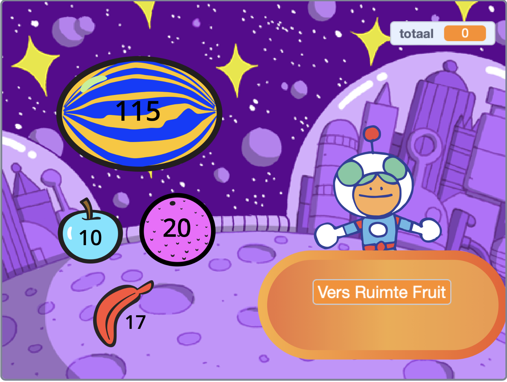
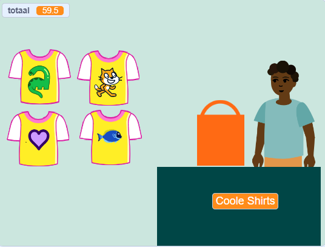

## Wat ga je maken

Maak een winkel-app waar de klant producten in je winkel kan kopen. Het project zal in de ik-persoon weergave zijn waar de speler een klant is.

--- no-print ---

Klik op Ruimtefruit om ze te kopen en zie het totaalbedrag oplopen. Als je klaar bent, klik je op Kiran om uit te checken.

+ Wat gebeurt er als je probeert af te rekenen voordat je fruit hebt uitgekozen?
+ Hoe weet het project volgens jou dat je nog geen fruit hebt toegevoegd?

**Vers Ruimte Fruit**: [Bekijk van binnen](https://scratch.mit.edu/projects/528696418/editor){:target="_blank"}

  <iframe allowtransparency="true" width="485" height="402" src="https://scratch.mit.edu/projects/embed/528696418/?autostart=false" frameborder="0"></iframe>

### Doe inspiratie op 💭

Klik op de **verkoper** sprites om producten te kopen:

**Coole shirts**: [Bekijk van binnen](https://scratch.mit.edu/projects/528697069/editor){:target="_blank"}

  <iframe allowtransparency="true" width="485" height="402" src="https://scratch.mit.edu/projects/embed/528697069/?autostart=false" frameborder="0"></iframe>

**IJssalon**: [Bekijk van binnen](https://scratch.mit.edu/projects/525972748/editor){:target="_blank"}

  <iframe allowtransparency="true" width="485" height="402" src="https://scratch.mit.edu/projects/embed/525972748/?autostart=false" frameborder="0"></iframe>

**⭐ Pride pins** (uitgelicht gemeenschapsproject)

Klik op de Pride Pin-badges om ze aan je winkelmandje toe te voegen:

  <iframe allowtransparency="true" width="485" height="402" src="https://scratch.mit.edu/projects/embed/750787529/?autostart=false" frameborder="0"></iframe>

--- /no-print ---

--- print-only ---

### Doe inspiratie op 💭

Je gaat een aantal ontwerpbeslissingen nemen om je personage te creëren. Bekijk voorbeeldprojecten in Scratch 2: Volgende klant alsjeblieft! Scratch Studio is te vinden op https://scratch.mit.edu/studios/29611454

   

--- /print-only ---

