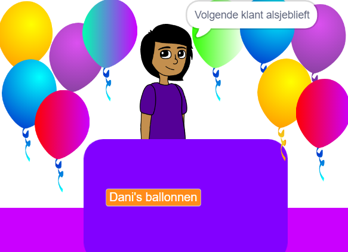
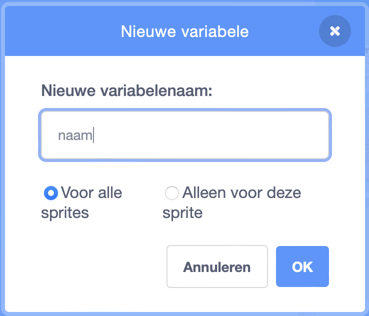
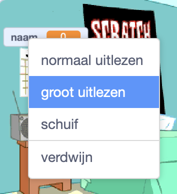

## Jouw idee voor een eigen bedrijf

<div style="display: flex; flex-wrap: wrap">
<div style="flex-basis: 200px; flex-grow: 1; margin-right: 15px;">
Wat is je idee voor een bedrijf? Het zou iets realistisch kunnen zijn, iets uit een boek of film die je leuk vindt, of iets heel geks.
</div>
<div>
{:width="300px"}
</div>
</div>

--- task ---

Open een [nieuw Scratch project](http://rpf.io/scratch-new){:target="_blank"} en kijk naar de sprites en achtergronden die je kunt gebruiken. Denk eens na over je zakelijke idee.

[[[working-offline]]]

--- /task ---

Welke achtergrond en extra landschap sprites heb je nodig?
+ Een achtergrond uit de Scratch bibliotheek, of een effen gekleurde achtergrond?
+ Een bureau, toonbank of raam om van te verkopen?
+ Een plank of boekenkast om producten op te zetten; je zou dit op de achtergrond kunnen tekenen

--- task ---

Klik op **Kies een achtergrond** of teken je eigen achtergrond.


Klik op **Kies een Sprite** en voeg extra scenariosprites toe of teken deze.


Je kunt later altijd meer elementen toevoegen als je dat graag wil.

--- /task ---

Hoe zal de **verkoper** sprite eruit zien?
+ Een persoon of een niet-speler personage zoals een winkelier, boer of bibliothecaris?
+ Een machine zoals een automaat, jukebox of kassa?

<p style="border-left: solid; border-width:10px; border-color: #0faeb0; background-color: aliceblue; padding: 10px;">
Een <span style="color: #0faeb0">**NPC**</span> is een niet-speler personage waarmee je in een spel of interactief verhaal kunt praten. Kun je games bedenken die je hebt gespeeld en die NPC's hebben? De volgende keer dat je speelt, bedenk je hoe het de taak van iemand was om dat personage te maken.
</p>

--- task ---

Voeg een sprite toe voor de verkoper.


--- /task ---

Wat is de naam van je bedrijf?

--- task ---

Maak een `variabele`{:class="block3variables"} met de naam `naam`:

--- collapse ---

---

Title: Maak een variabele

---

Klik in het menu `Variabelen`{:class="block3variables"} op de knop **Maak een variabele**.

Noem je nieuwe variabele `naam`:



**Opmerking:** De nieuwe `naam` variabele verschijnt op het speelveld en kan nu worden gebruikt in de `variabele`{:class="block3variables"} blokken.

--- /collapse ---

Klik op je **verkoper** sprite en voeg code toe om de variabele in te stellen op de naam van je bedrijf:

```blocks3
when flag clicked
set [naam v] to () //typ de naam van je bedrijf
```

Maak een bord op het speelveld met je variabele:

--- collapse ---

---

Title: Verander de vormgeving en positie van variabelen

---

Klik met de rechtermuisknop op de `variabele`{:class="block3variables"} op het speelveld en kies groot uitlezen:



Sleep je `variabele`{:class="block3variables"} om deze op het speelveld te plaatsen als onderdeel van de winkelinrichting.

--- /collapse ---

--- /task ---

--- task ---

**Test:** Zorg ervoor dat je je bedrijfsnaam kunt zien als de waarde van de variabele in het speelveld.

--- /task ---

Maak je klaar om je eerste klant te verwelkomen.

--- task ---

Klik op je **verkoper** sprite en voeg een `uitzending`{:class="block3control"} blok toe. Maak een nieuw bericht met de naam `volgende klant`.

```blocks3
when flag clicked
set [naam v] to [my shop] // je bedrijfsnaam
+ broadcast (volgende klant v)
```

--- /task ---

--- task ---

Maak een nieuw script voor je **verkoper** sprite om `te zeggen`{:class="block3looks"} `volgende klant asljeblieft` wanneer deze het `bericht`{:class="block3control"} `volgende klant`{:class="block3control"} ontvangt.

```blocks3
when I receive [volgende klant v] 
say [Volgende klant alsjeblieft!] for (2) seconds
```

--- /task ---

--- task ---

**Debug:** Mogelijk vindt je enkele fouten in jouw project die je moet oplossen. Hier is een veel voorkomende fout.

--- collapse ---

---

Title: Variabele toont `0`

---

Je moet het `zet [naam v] op ()`{:class="block3variables"} blok gebruiken om de variabele op je naam in te stellen. Als je al een script hebt toegevoegd, controleer dan of je je bedrijfsnaam in de waarde hebt getypt en op de groene vlag hebt geklikt.

```blocks3
when flag clicked
set [naam v] to [mijn winkel] // je bedrijfsnaam
```

--- /collapse ---

--- /task ---

--- save ---
