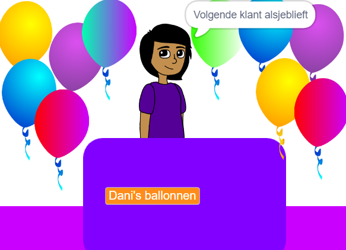

## Jouw winkel

<div style="display: flex; flex-wrap: wrap">
<div style="flex-basis: 200px; flex-grow: 1; margin-right: 15px;">
Wat is jouw winkelidee? Het zou iets realistisch kunnen zijn, iets uit een boek of film die je leuk vindt, of iets heel geks.
</div>
<div>
{:width="300px"}
</div>
</div>

--- task ---

Open een [nieuw Scratch project](http://rpf.io/scratch-new){:target="_blank"} en kijk naar de sprites en achtergronden die je kunt gebruiken. Neem de tijd om na te denken over je winkelidee.

--- /task ---

--- task ---

**Kies een achtergrond** of teken je eigen achtergrond.


+ Een achtergrond uit de Scratch bibliotheek, of een effen gekleurde achtergrond

--- /task ---

--- task ---

**Kies een sprite** en voeg extra inrichtingssprites toe of teken ze zelf.


--- /task ---

--- task ---

Voeg meer inrichtingselementen toe.
+ Een bureau, toonbank of etalage om vanuit te verkopen
+ Een plank of boekenkast om producten op te zetten; je zou dit op de achtergrond kunnen tekenen

--- /task ---

--- task ---

Voeg een sprite toe voor de verkoper.

Je zou kunnen kiezen:
+ Een persoon of een niet-speler personage zoals een winkelier, boer of bibliothecaris
+ Een machine zoals een automaat, jukebox of kassa


--- /task ---

### Verwelkom jouw eerste klant.

--- task ---

Klik op je **verkoper** sprite en voeg een `wanneer ik signaal ontvang`{:class="block3events"} blok toe. Maak een nieuw bericht met de naam `volgende klant`.

```blocks3
when flag clicked
+ broadcast (volgende klant v)
```

--- /task ---

--- task ---

Maak een nieuw script voor je **verkoper** sprite om `te zeggen`{:class="block3looks"} `volgende klant alsjeblieft` wanneer deze het `signaal`{:class="block3control"} `volgende klant`{:class="block3control"} ontvangt.

```blocks3
when I receive [volgende klant v] 
say [Volgende klant alsjeblieft!] for (2) seconds
```

--- /task ---

--- save ---
