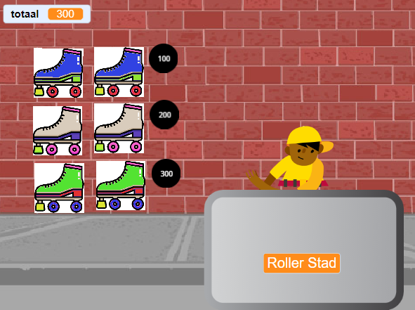
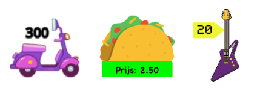

## Producten te koop

<div style="display: flex; flex-wrap: wrap">
<div style="flex-basis: 200px; flex-grow: 1; margin-right: 15px;">
Je winkel heeft producten nodig om te verkopen. Elk item heeft een prijs die wordt toegevoegd aan een 'totaal'{:class="block3variables"} variabele.
</div>
<div>
{:width="300px"}
</div>
</div>

Je moet bijhouden hoeveel je klant uitgeeft.

--- task ---

Task ---Voeg een nieuwe variabele toe met de naam `totaal`{:class="block3variables"} voor alle sprites.

Klik op je **verkoper** sprite en voeg een script toe aan `maak`{:class="block3variables"} het `totaal`{:class="block3variables"} `0` wanneer het project begint.

[[[scratch3-create-set-variable]]]

--- /task ---

Welke **producten** gaat je klant(en) kopen?
+ Eten of drinken
+ Sportuitrusting, speelgoed of gadgets
+ Toverstokken, drankjes of boeken met toverspreuken
+ Kleding of andere mode-items
+ Jouw eigen idee

--- task ---

Voeg een sprite toe voor het eerste **product** dat je in je winkel gaat verkopen.

Als je wilt, kun je een prijs aan het uiterlijk toevoegen met behulp van het tekstgereedschap in de Paint editor. Of voeg een prijs toe aan de achtergrond en plaats het item ernaast.



--- /task ---

--- task ---

Voeg een script toe aan `verander`{:class="block3variables"} het `totaal`{:class="block3variables"} met de prijs van je product wanneer de klant op de sprite klikt.

--- collapse ---
---
title: Klik om een product toe te voegen
---

```blocks3
when this sprite clicked
start sound (Coin v)
change [totaal v] by [10]
```

--- /collapse ---

Het is ook een goed idee om `een geluid`{:class="block3sound"} af te spelen om de klant te laten weten dat hij een product heeft toegevoegd.


[[[scratch3-add-sound]]]

--- /task ---

--- task ---

**Test:** Klik op je product en controleer of de waarde van de `totaal`{:class="block3variables"} variabele toeneemt met de prijs van het product, en controleer ook of je het geluidseffect hoort. Klik meerdere keren om het totaal te zien toenemen.

Klik op de groene vlag om je project te starten en zorg ervoor dat het `totaal`{:class="block3variables"} begint op `0`.

--- /task ---

--- task ---

Voeg meer producten toe aan je winkel.

Je kunt:
+ Het eerste product kopiëren en vervolgens een nieuw uiterlijk toevoegen in de Paint editor
+ Voeg een sprite toe en sleep vervolgens het `wanneer op de groene vlag wordt geklikt`{:class="block3events"} script van het eerste product naar je nieuwe product

Voeg een prijslabel toe aan het uiterlijk of de achtergrond als je die gebruikt.

--- /task ---

--- task ---

Task ---Klik op je nieuwe **product** sprite in de Sprite-lijst en klik vervolgens op het tabblad **Code**.

Change the amount the `total`{:class="block3variables"} changes by to the price of your new item.

--- /task ---

--- task ---

**Test:** Klik op de groene vlag om je project te starten en klik op producten om ze toe te voegen. Controleer of het totaal met de juiste hoeveelheid toeneemt telkens wanneer je op een producten klikt.

Als je prijslabels hebt toegevoegd, zorg er dan voor dat ze overeenkomen met het bedrag dat wordt toegevoegd aan het `totaal`{:class="block3variables"}, anders snappen je klanten het niet!

--- /task ---

--- task ---

**Debug:** Mogelijk vindt je enkele fouten in jouw project die je moet oplossen. Hier zijn enkele veelvoorkomende fouten.

--- collapse ---
---
title: Het totaal gaat niet naar 0 wanneer ik op de groene vlag klik
---

Controleer of je de beginwaarde van de `totaal`{:class="block3variables"} variabele hebt ingesteld in het `wanneer op de groen vlag wordt geklikt`{:class="block3events"} script op je **verkoper** sprite.

--- /collapse ---

--- collapse ---
---
title: Het totaal stijgt niet met het juiste bedrag wanneer ik op een product klik
---

Controleer of elk product een `wanneer op deze sprite wordt geklikt`{:class="block3events"} script heeft dat het `totaal`{:class="block3variables"} wijzigt met het juiste bedrag voor dat product; je hebt mogelijk de prijs voor de verkeerde sprite gewijzigd.

Controleer of je het `verander`{:class="block3variables"} blok en niet het `maak`{:class="block3variables"} blok hebt gebruikt om het `totaal`{:class="block3variables"} te veranderen. Je moet het `verander`{:class="block3variables"} blok gebruiken om de prijs toe te voegen aan het totaal, je wilt het totaal niet instellen op de prijs van het product dat zojuist is toegevoegd.

--- /collapse ---

--- /task ---

--- save ---
