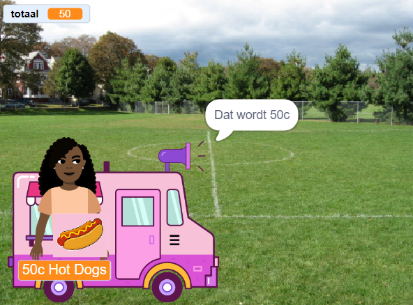

## Aankopen

<div style="display: flex; flex-wrap: wrap">
<div style="flex-basis: 200px; flex-grow: 1; margin-right: 15px;">
De **verkoper** sprite moet:
- vragen of de klant klaar is om te betalen voor de producten
- betaling aannemen
- zich klaar maken voor de volgende klant
</div>
<div>
{:width="300px"}
</div>
</div>

Wanneer ze klaar zijn met het kiezen van producten, zal de klant op de **verkoper** sprite klikken om te betalen.

--- task ---

 Vertel de klant hoeveel zijn producten gaan kosten.

```blocks3
when this sprite clicked
say (join [Dat is dan ] (totaal)) for (2) seconds 
```

--- /task ---

--- task ---

Voeg een betalingsgeluid toe aan je **verkoper** sprite, zodat de klant weet dat de betaling plaatsvindt.


[[[scratch3-add-sound]]]

Voeg het `start geluid en wacht`{:class="block3sound"} blok toe aan je script.

```blocks3
when this sprite clicked
say (join [Dat is dan ] (totaal)) for (2) seconds
+ play sound [machine v] until done 
```

--- /task ---

--- task ---

Maak de verkoop af. Zet `totaal`{:class="block3variables"} terug naar `0` na betaling, `zeg`{:class="block3looks"} tot ziens en `zend`{:class="block3control"} het `volgende klant`{:class="block3control"} bericht.

```blocks3
when this sprite clicked
say (join [Dat is dan ] (totaal)) for (2) seconds
play sound [machine v] until done 
+ set [totaal v] to (0)
+ say (join [Bedankt voor het winkelen bij ] (naam)) for (2) seconds
+ broadcast (volgende klant v)
```

--- /task ---

--- task ---

Misschien wil je de klant de mogelijkheid geven om zijn boodschappen te annuleren.

--- collapse ---
---
title: Betaal- en annuleer opties instellen
---

`Vraag`{:class="block3sensing"} `Wilt u betalen of annuleren?`. Voeg een `als`{:class="block3control"} blok toe voor `antwoord`{:class="block3sensing"} `=`{:class="block3operators"} `betaal` en zet daarin je bestaande betalingsblokken.

```blocks3
when this sprite clicked
say (join [Dat is dan ] (totaal)) for (2) seconds
+ ask [Wil je betalen of annuleren?] and wait
+ if {(answer) = [betalen]} then
play sound [machine v] until done 
set [totaal v] to (0)
say (join [Bedankt voor het winkelen bij ] (naam)) for (2) seconds
broadcast [volgende klant v]
end
```

Voeg een tweede `als`{:class="block3control"} blok toe voor `antwoord`{:class="block3sensing"} `=`{:class="block3operators"} `annuleren` en voeg daar code aan toe om de bestelling te annuleren.

```blocks3
when this sprite clicked
say (join [Dat is dan ] (totaal)) for (2) seconds
ask [Wil je betalen of annuleren?] and wait
if {(answer) = [betalen]} then
play sound [machine v] until done 
set [totaal v] to (0)
say (join [Bedankt voor het winkelen bij ] (naam)) for (2) seconds
broadcast [volgende klant v]
end
+ if {(answer) = [annuleer]} then
set [totaal v] to (0)
say [Ok. Geen probleem] for (2) seconds
broadcast [volgende klant v]
end
```

--- /collapse ---

--- /task ---

--- task ---

Om er zeker van te zijn dat je klant producten in zijn/haar mandje heeft voordat ze gaan betalen, kun je een `als....dan`{:class="block3control"} blok invoegen.

--- collapse ---
---
title: Controleer totaalbedrag
---

`Als`{:class="block3control"} `totaal`{:class="block3variables"} `>`{:class="block3operators"} `0` is, voeg dan je bestaande script toe.

`Anders`{:class="block3control"} `zeg`{:class="block3looks"} een nuttig bericht.

```blocks3
when this sprite clicked
+ if <(totaal) > [0]>then
say (join [Dat is dan ] (totaal)) for (2) seconds
ask [Wil je betalen of annuleren?] and wait
if {(answer) = [betalen]} then
play sound [machine v] until done 
set [totaal v] to (0)
say (join [Bedankt voor het winkelen bij ] (naam)) for (2) seconds
broadcast [volgende klant v]
end
if {(answer) = [annuleer]} then
set [totaal v] to (0)
say [Ok. Geen probleem] for (2) seconds
broadcast [volgende klant v]
end
else
say [Klik op de producten die je wilt] for (2) seconds
end
```

--- /collapse ---

--- /task ---

--- task ---

**Test:** Test je project en zorg ervoor dat:
- De klant kan betalen met de juiste geluidseffecten
- Het `totaal`{:class="block3variables"} weer op `0` wordt ingesteld nadat een klant betaalt of annuleert.

--- /task ---


--- task ---

**Debug:** Mogelijk vindt je enkele fouten in jouw project die je moet oplossen.

Hier zijn enkele veelvoorkomende fouten:

--- collapse ---
---
title: De verkoper doet niets wanneer ik erop klik
---

Je hebt heel veel sprites in je project. Zorg ervoor dat het `wanneer op deze sprite wordt geklikt`{:class="block3events"} script op je **verkoper** sprite staat.

**Tip:** als je het aan de verkeerde sprite hebt toegevoegd, kun je de code naar de **verkoper** sprite slepen en vervolgens uit de andere sprite verwijderen.

--- /collapse ---

--- collapse ---
---
title: De verkoper zegt 'totaal' en niet het totale bedrag
---

Zorg ervoor dat je `zeg`{:class="block3looks"} blok het `totaal`{:class="block3variables"} variabele blok heeft, niet het woord `totaal`.

```blocks3
 when this sprite clicked
 say {join [Dat is dan ](totaal)} for (2) seconds 
 ```

--- /collapse ---

--- collapse ---
---
title: De woorden in de zeg blokken worden aan elkaar geplakt
---

Wanneer je `twee stukken aan elkaar toevoegt`{:class="block3operators"}, moet je een spatie toevoegen aan het einde van je eerste stuk tekst of aan het begin van je tweede stuk tekst.

Deze hebben een spatie aan het einde van het eerste deel:

```blocks3
say {join [Dat is dan ](totaal)} for (2) seconds

say {join [Bedankt voor het winkelen bij ](naam)} for (2) seconds
```

--- /collapse ---

--- collapse ---
---
title: Het totaal wordt niet op 0 gezet na een verkoop
---

Controleer of je het volgende hebt gebruikt:

```blocks3
set [total v] to (0)
```

**niet**:

```blocks3
change [totaal v] by (0)
```

--- /collapse ---

--- collapse ---
---
title: De verkoper reageert niet
---

Zorg ervoor dat de `functie`{:class="block3operators"} in de `als`{:class="block3control"} voorwaarde groter is dan het symbool `>`{:class="block3operators"}.

```blocks3
if <(totaal) > [0]> then
```

--- /collapse ---

**Tip:** Vergelijk je code met de voorbeelden. Zijn er verschillen die er niet zouden moeten zijn?

--- /task ---

--- save ---
