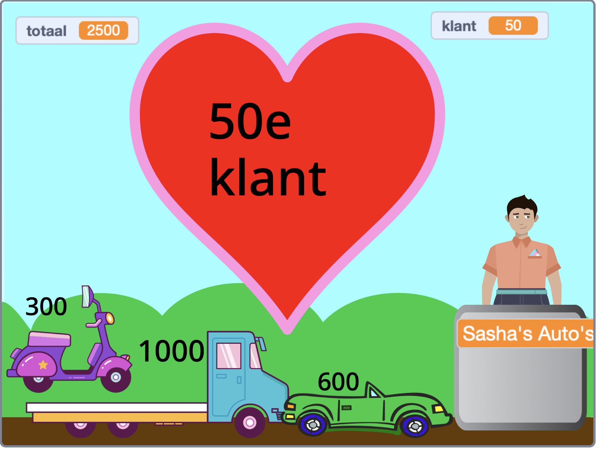

## Extra functies

<div style="display: flex; flex-wrap: wrap">
<div style="flex-basis: 200px; flex-grow: 1; margin-right: 15px;">
Er zijn veel functies die je kunt toevoegen om de winkelervaring van je klanten te verbeteren. Je hoeft niet alles toe te voegen. Voeg gewoon verbeteringen toe die je belangrijk vindt.

</div>
<div>
{:width="300px"}
</div>
</div>

Je kunt 'binnen zien' in de voorbeeldprojecten om te kijken hoe ze werken.

Voorbeeldprojecten:
**Vers Ruimte Fruit**: [Zie binnenkant](https://scratch.mit.edu/projects/707255579/editor){:target="_blank"}
**Coole Shirts**: [Zie binnenkant](https://scratch.mit.edu/projects/707254479/editor){:target="_blank"}
**IJssalon**: [Zie binnenkant](https://scratch.mit.edu/projects/707255735/editor){:target="_blank"}
**Verkoopautomaat**: [Binnenkijken](https://scratch.mit.edu/projects/707255880/editor){:target="_blank"}

**Tip:** als je bent aangemeld bij een Scratch-account, dan kun je de **Backpack** gebruiken om scripts of sprites naar je project te kopiëren.

[[[scratch-backpack]]]

--- task ---

Denk je dat je verkoper (of machine) meer vragen zou moeten stellen?

Je kunt `vraag`{:class="block3sensing"} blokken toevoegen aan je **verkoper**'s `wanneer op deze sprite wordt geklikt`{:class="block3events"}-script en `zeg`{:class="block3looks"} verschillende dingen, afhankelijk van de reactie van de klant.

Je zou kunnen vragen of de service goed was, of dat ze een leuke dag hebben. Of iets specifieks voor je winkel, zoals "wat ga je koken?"

--- collapse ---

---

title: Stel en beantwoord vragen

---

```blocks3
ask [Heb je alles gevonden wat je vandaag nodig hebt?] and wait
if <(answer) = [ja]> then
say [Dat is fantastisch!] for [2] seconds
else
say [Misschien moet ik meer producten aan mijn winkel toevoegen] for [2] seconds
end
```

**Debug:** Controleer dat je de opties in je code en antwoord goed gespeld hebt. Het is OK als je hoofdletters gebruikt, dus "Ja" en "JA" komen overeen met "ja".

Voeg meerdere vragen toe om een chatbot of een "niet-speler karakter" te maken waarmee je kunt praten.

--- /collapse ---

--- /task ---

Wil je dat er iets anders gebeurt wanneer je een product toevoegt?

--- task ---

Het Coole Shirts project heeft shirts die in een tas glijden.

--- collapse ---

---

title: Laat voorwerpen in een verpakking glijden

---

Voeg een **Verpakking** sprite toe. Je kunt een bestaande sprite gebruiken zoals de **Gift** of **Takeout** sprite, of je eigen sprite tekenen met eenvoudige vormen.

Voeg een script toe om de **Verpakking** altijd vooraan te laten verschijnen:

```blocks3
when flag clicked
forever
go to [front v] layer
end
```

Vervolgens moet je code toevoegen aan elk **product** dat je aanbiedt om ze naar de verpakking te laten glijden wanneer ze worden aangeklikt:

```blocks3
when this sprite clicked
+go to [front v] layer
+glide [1] secs to (Tas v) // gebruik de naam van je Container sprite
+hide
change [totaal v] by [12]
+go to x: [-180] y: [68] // beginpositie
+show
```

Als je de verpakking niet altijd wilt laten zien, kun je scripts toevoegen om hem op het juiste moment te laten zien en verbergen:

```blocks3
when I receive [volgende klant v]
hide // vorige klant neemt de tas
wait [1] seconds
show
```

**Test:** Probeer je project en zorg ervoor dat producten naar de verpakking glijden en verdwijnen.

**Debug:** Controleer zorgvuldig je scripts en zorg ervoor dat je al je **Product** sprites hebt bijgewerkt. Je kunt [Coole shirts](https://scratch.mit.edu/projects/707254479/editor){:target="_blank"} bekijken als je een werkend voorbeeld wilt zien.

--- /collapse ---

Het IJssalon project toont het ijs terwijl de klant zijn smaken kiest.

--- collapse ---

---

title: Pas een sprite aan en laat deze zien

---

Elk product moet een `zend signaal`{:class="block3events"} blok in zijn `wanneer op deze sprite wordt geklikt`{:class="block3events"} script hebben:

```blocks3
+broadcast (1 lepel v)
```

Dan moet de sprite die je wilt laten zien of veranderen op dat bericht reageren:

```blocks3
when I receive [1 lepel v]
play sound (Chomp v) until done
switch costume to (1 lepel v)
```

Je kunt ook de sprite voor een nieuwe klant wijzigen of verbergen:

```blocks3
when I receive [volgende klant v]
switch costume to (ijshoorntje v)
```

Als je meerdere producten hebt, moet je meer berichten en scripts toevoegen om ze te ontvangen.

--- /collapse ---

--- /task ---

Heb je gemerkt dat je klant producten kan toevoegen nadat ze zijn begonnen met afrekenen?

--- task ---

Als je wilt stoppen met het toevoegen van producten aan de klant wanneer deze aan het afrekenen is, kun je een `winkelen`{:class="block3variables"} variabele toevoegen en deze gebruiken om te bepalen wanneer producten kunnen worden toegevoegd.

--- collapse ---

---
title: Alleen aankopen toestaan wanneer de klant niet aan het afrekenen is

---

Voeg voor alle sprites een `variabele`{:class="block3variables"} met de naam `winkelen` toe. Je zet dit op `waar` wanneer de klant in de winkel is en `niet waar` wanneer hij of zij aan het afrekenen is.

Selecteer je **verkoper** sprite. Werk het `wanneer op de groene vlag wordt geklikt`{:class="block3events"} script bij om winkelen toe te staan wanneer je project begint:

```blocks3
+set [winkel v] to [waar]
```

Voeg nu een blok toe om de `winkelen`{:class="block3variables"} variabele te veranderen in `niet waar` aan het begin van het **verkoper**'s `wanneer op deze sprite wordt geklikt`{:class="block3events"} script:

```blocks3 
+set [winkel v] to [niet waar]
```

En een blok om de `winkelen`{:class="block3variables"} variabele terug te zetten naar `waar` aan het einde van hetzelfde script:

```blocks3 
+set [winkel v] to [waar]
```

Nu moet je de producten die je verkoopt bijwerken om de `winkelen`{:class="block3variables"} variabele te controleren:

```blocks3
when this sprite clicked
+if <(winkel) = [waar]> then
start sound (Coin v)
change [totaal v] by [10]
end
```

Je moet dit doen voor elk product dat je in je winkel verkoopt.

**Test:** Klik op de groene vlag en probeer te winkelen. Controleer of je nog steeds producten kunt toevoegen en afrekenen, maar dat je geen producten kunt toevoegen nadat je bent begonnen met afrekenen.

**Debug:** Controleer je code heel zorgvuldig. Je kunt het [Ruimte fruit](https://scratch.mit.edu/projects/707255579/editor){:target="_blank"} project bekijken als je een werkend voorbeeld wilt zien.

--- /collapse ---

--- /task ---

--- save ---

