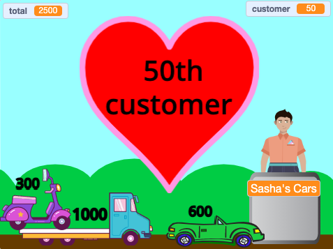

## Uitdaging

<div style="display: flex; flex-wrap: wrap">
<div style="flex-basis: 200px; flex-grow: 1; margin-right: 15px;">
Er zijn veel functies die je kunt toevoegen om de winkelervaring van je klanten te verbeteren. Je hoeft niet alles toe te voegen. Voeg gewoon verbeteringen toe die je belangrijk vindt.
</div>
<div>
{:width="300px"}
</div>
</div>

--- task ---

Voeg meer producten toe om te verkopen.

--- /task ---

--- task ---

Voeg meer grafische en geluidseffecten toe.

--- /task ---

--- task ---

Teken je eigen achtergrond en andere uiterlijken.

--- /task ---

--- task ---

Maak een ander bedrijf en laat spelers ze allebei bezoeken.

--- /task ---

Elk voorbeeldproject in de [Inleiding](.) heeft een link 'bekijk van binnen' om het project in Scratch te openen, en de code te bekijken om ideeën te krijgen en te zien hoe ze werken. Je kunt de voorbeeldprojecten 'van binnen bekijken' om te zien hoe ze werken.

Voorbeelden van projecten:
**Vers ruimtefruit**: [Bekijk van binnen](https://scratch.mit.edu/projects/707255579/editor){:target="_blank"}
**Coole shirts**: [Bekijk van binnen](https://scratch.mit.edu/projects/707254479/editor){:target="_blank"}
**IJssalon**: [Bekijk van binnen](https://scratch.mit.edu/projects/707255735/editor){:target="_blank"}
**Verkoopautomaten**: [Bekijk van binnen](https://scratch.mit.edu/projects/707255880/editor){:target="_blank"}

**Tip:** Als je bent ingelogd op een Scratch-account, kun je de **Rugzak** gebruiken om scripts of sprites naar je project te kopiëren.

[[[scratch-backpack]]]

### Gezellige kassamedewerker!

Je kassamedewerker (of machine) zou kunnen vragen of de service goed was, of dat de klant een fijne dag heeft.

--- task ---

Voeg `vraag`{:class="block3sensing"} blokken toe aan je **verkoper**'s `wanneer op deze sprite wordt geklikt`{:class="block3events"} script en `zeg`{:class="block3looks"} verschillende dingen afhankelijk van het antwoord van de klant.

--- collapse ---

---
title: Vragen stellen en beantwoorden
---

```blocks3
ask [Heb je alles gevonden wat je vandaag nodig hebt?] and wait
if <(answer) = [ja]> then
say [Dat is fantastisch!] for [2] seconds
else
say [Misschien moet ik meer producten aan mijn winkel toevoegen] for [2] seconds
end
```

**Fouten opsporen:** Controleer of je de opties in je code en in je antwoord correct hebt gespeld. Het is prima als je hoofdletters gebruikt, dus "Ja" en "JA" komen overeen met "ja".

Voeg meerdere vragen toe om een chatbot of een "niet-speler karakter" te maken waarmee je kunt praten.

--- /collapse ---

--- /task ---

### Doe de spullen in een tas

--- task ---

Het Coole Shirts project heeft shirts die in een tas glijden.

--- collapse ---

---
title: Laat voorwerpen in een verpakking glijden
---

Voeg een **Verpakking** sprite toe. Je kunt een bestaande sprite gebruiken zoals de **Gift** of **Takeout** sprite, of je eigen sprite tekenen met eenvoudige vormen.

Voeg een script toe om de **Verpakking** altijd vooraan te laten verschijnen:

```blocks3
when flag clicked
forever
go to [voorgrond v] layer
end
```

Vervolgens moet je code toevoegen aan elk **product** dat je aanbiedt om ze naar de verpakking te laten glijden wanneer ze worden aangeklikt:

```blocks3
when this sprite clicked
+go to [voorgrond v] layer
+glide [1] secs to (Bag v) // gebruik de naam van je Container sprite
+hide
change [totaal v] by [12]
+go to x: [-180] y: [68] // beginpositie
+show
```

Als je de verpakking niet altijd wilt laten zien, kun je scripts toevoegen om hem op het juiste moment te laten verschijnen en verdwijnen:

```blocks3
when I receive [volgende klant v]
hide // vorige klant neemt de tas
wait [1] seconds
show
```

**Test:** Probeer je project en zorg ervoor dat producten naar de verpakking glijden en verdwijnen.

**Debug:** Controleer zorgvuldig je scripts en zorg ervoor dat je al je **Product** sprites hebt bijgewerkt. Je kunt [Coole shirts](https://scratch.mit.edu/projects/707254479/editor){:target="_blank"} bekijken als je een werkend voorbeeld wilt zien.

--- /collapse ---

--- /task ---

###  Stop met het toevoegen van artikelen wanneer de klant bij de kassa is

--- task ---

Voeg een `winkel`{:class="block3variables"} variabele toe en gebruik deze om te bepalen wanneer artikelen kunnen worden toegevoegd.

--- collapse ---

---
title: Stop aankopen wanneer de klant bij de kassa staat
---

Voeg voor alle sprites een `variabele`{:class="block3variables"} met de naam `winkelen` toe. Je stelt deze in op `waar` wanneer de klant in de winkel is en op `niet waar` wanneer ze bij de kassa staan.

Selecteer je **verkoper** sprite. Werk het `wanneer op de groene vlag wordt geklikt`{:class="block3events"} script bij om winkelen toe te staan wanneer je project begint:

```blocks3
+set [winkel v] to [waar]
```

Voeg nu een blok toe om de `winkelen`{:class="block3variables"} variabele te veranderen in `niet waar` aan het begin van het **verkoper**'s `wanneer op deze sprite wordt geklikt`{:class="block3events"} script:

```blocks3 
+set [winkel v] to [niet waar]
```

En een blok om de `winkelen`{:class="block3variables"} variabele terug te zetten naar `waar` aan het einde van hetzelfde script:

```blocks3 
+set [winkel v] to [waar]
```

Nu moet je de producten die je verkoopt bijwerken om de `winkelen`{:class="block3variables"} variabele te controleren:

```blocks3
when this sprite clicked
+if <(winkel) = [waar]> then
start sound (Coin v)
change [totaal v] by [10]
end
```
Je moet dit doen voor elk product dat je in je winkel verkoopt.

**Test:** Klik op de groene vlag en probeer te winkelen. Controleer of je nog steeds producten kunt toevoegen en afrekenen, maar dat je geen producten kunt toevoegen nadat je bent begonnen met afrekenen.

**Fouten opsporen:** Controleer je code heel zorgvuldig. Je kunt het [Ruimte fruit](https://scratch.mit.edu/projects/707255579/editor){:target="_blank"} project bekijken als je een werkend voorbeeld wilt zien.

--- /collapse ---

--- /task ---

--- task ---

### Geef de klant de mogelijkheid om zijn bestelling te annuleren.

--- collapse ---

---
title: Stel betaal- en annuleringsopties in
---

`Vraag`{:class="block3sensing"} `Wil je betalen of annuleren?`. Voeg een `als`{:class="block3control"} blok toe voor `antwoord`{:class="block3sensing"} `=`{:class="block3operators"} `betaal` en zet daarin je bestaande betalingsblokken.

```blocks3
when this sprite clicked
say (join [Dat is dan ] (totaal)) for (2) seconds
+ ask [Wil je betalen of annuleren?] and wait
+ if {(answer) = [betalen]} then
play sound [machine v] until done 
set [totaal v] to (0)
say (join [Bedankt voor het winkelen bij ] (naam)) for (2) seconds
broadcast [volgende klant v]
end
```

Voeg een tweede `als`{:class="block3control"} blok toe voor `antwoord`{:class="block3sensing"} `=`{:class="block3operators"} `annuleren` en voeg daar code aan toe om de bestelling te annuleren.

```blocks3
when this sprite clicked
say (join [Dat is dan ] (totaal)) for (2) seconds
ask [Wil je betalen of annuleren?] and wait
if {(answer) = [betalen]} then
play sound [machine v] until done 
set [totaal v] to (0)
say (join [Bedankt voor het winkelen bij ] (naam)) for (2) seconds
broadcast [volgende klant v]
end
+ if {(answer) = [annuleren]} then
set [totaal v] to (0)
say [Ok. Geen probleem] for (2) seconds
broadcast [forvolgende klant v]
end
```

--- /collapse ---

--- /task ---

Bekijk onze ['Intergalactische markt'](https://scratch.mit.edu/studios/29662180){:target="_blank"} Scratch-studio om projecten te zien die zijn gemaakt door community-leden.

--- save ---
