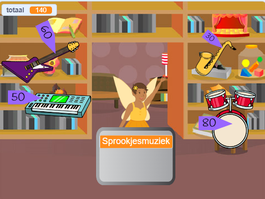

## Verbeter je project

Als je tijd hebt, kun je jouw project verbeteren.

{:width="300px"}

Hier zijn een paar andere ideeën die je zou kunnen proberen:
- Voeg meer producten toe om te verkopen
- Voeg meer grafische en geluidseffecten toe
- Teken je eigen achtergrond en andere uiterlijken
- Maak een ander bedrijf en laat spelers ze allebei bezoeken

Elk voorbeeldproject in de [Inleiding](.) heeft een link 'zie binnen' om het project in Scratch te openen, en de code te bekijken om ideeën op te halen en te zien hoe ze werken.

Bekijk onze ['Intergalactische markt'](https://scratch.mit.edu/studios/29662180){:target="_blank"} Scratch-studio om projecten te bekijken die zijn gemaakt door community-leden.

--- save ---
