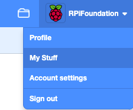

## Deel

Als je lid bent van een club, waarom zou je je project dan niet delen met vrienden?

Als je bent aangemeld bij Scratch, kun je een studio maken en je **Volgende klant** project toevoegen. Je kunt ook **Volgende klant**-projecten van je vrienden toevoegen om een winkelcentrum met verschillende winkels en bedrijven te maken.

--- collapse ---

---

title: Bouw een winkelcentrum

---

Sla je project op, klik dan op je gebruikersnaam en selecteer **Mijn projecten**.

Klik op de pagina **Mijn projecten** op de knop **+ Nieuwe Studio**.

Geef je nieuwe studio een naam en beschrijving.

Klik op de knop **Projecten toevoegen**. Je kunt een eigen project toevoegen door het te selecteren in de lijst onder aan de pagina.

Je kunt ook projecten toevoegen die je vrienden hebben gemaakt. Vraag ze om hun project te delen en jou de link te geven. Typ of plak de link in het url-vak en klik vervolgens op de knop **Toevoegen op url**.

--- /collapse ---

Deel je project en stuur een link naar mensen die je kent. De hele Scratch-community kan zo je project vinden en uitproberen.

[[[share-scratch]]]

Waarom nodig je je vrienden niet uit om een project te maken? Laat ze weten hoeveel plezier je hebt gehad.

Als je een Scratch-account hebt en je **Volgende klant wilt** project hebt gedeeld, houd dan opmerkingen die anderen kunnen maken over je creatie in de gaten. Terugkoppeling is een geweldige manier om te reflecteren op je werk. Negeer alle opmerkingen die nutteloos of irrelevant zijn.

[[[comments-feedback-scratch]]]

--- task ---

Inspireer de Raspberry Pi Foundation-gemeenschap met jouw project!

Om je ['Intergalaktisch winkelcentrum'](https://scratch.mit.edu/studios/29662180){:target="_blank"} Scratch studio project in te dienen vul [dit formulier](https://form.raspberrypi.org/f/community-project-submissions){:target="_blank"} in.

--- /task ---
