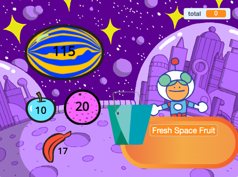

## Co stworzysz

Stwórz aplikacje sklepu, w której klient może kupować produkty. Projekt będzie wyświetlany z perspektywy pierwszej osoby. Gracz wciela się w rolę klienta.

--- no-print ---

Click on Space Fruit to buy them and watch the total go up. Kliknij na Kiran, aby zapłacić za zakupy.

+ Co się stanie, jeśli spróbujesz zapłacić, zanim wybierzesz jakikolwiek owoc?
+ Jak myślisz, skąd aplikacja wie, że nie dodałeś jeszcze żadnych owoców do koszyka?

**Świeże owoce**: [Zobacz wnętrze](https://scratch.mit.edu/projects/528696418/editor){:target="_blank"}

  <iframe allowtransparency="true" width="485" height="402" src="https://scratch.mit.edu/projects/embed/528696418/?autostart=false" frameborder="0"></iframe>

### Jaki masz pomysł? 💭

Click on the **seller** sprites to buy items:

**Cool Shirts**: [See inside](https://scratch.mit.edu/projects/528697069/editor){:target="_blank"}

  <iframe allowtransparency="true" width="485" height="402" src="https://scratch.mit.edu/projects/embed/528697069/?autostart=false" frameborder="0"></iframe>

**Ice cream shop**: [See inside](https://scratch.mit.edu/projects/525972748/editor){:target="_blank"}

  <iframe allowtransparency="true" width="485" height="402" src="https://scratch.mit.edu/projects/embed/525972748/?autostart=false" frameborder="0"></iframe>

**⭐ Tęczowa przypinka** (wyróżniony projekt społeczności)

Kliknij na tęczowe odznaki, aby dodać je do koszyka:

  <iframe allowtransparency="true" width="485" height="402" src="https://scratch.mit.edu/projects/embed/750787529/?autostart=false" frameborder="0"></iframe>

--- /no-print ---

--- print-only ---

### Jaki masz pomysł? 💭

Musisz podjąć decyzje projektowe, aby stworzyć swoją postać. See inside example projects in the Scratch 2: Next customer please! Scratch studio at https://scratch.mit.edu/studios/29611454

   

--- /print-only ---

