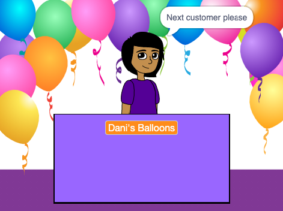

## Your shop

<div style="display: flex; flex-wrap: wrap">
<div style="flex-basis: 200px; flex-grow: 1; margin-right: 15px;">
What is your shop idea? Może to być coś realistycznego, jak księgarnia lub kino, lub coś kompletnie nie z tej ziemi.
</div>
<div>
{:width="300px"}
</div>
</div>

--- task ---

Otwórz [nowy projekt Scratch](http://rpf.io/scratch-new){:target="_blank"} i zobacz jakie tła i duszki są dostępne do użycia w projekcie. Spend some time thinking about your shop idea.

--- /task ---

--- task ---

**Choose a Backdrop** or paint your own backdrop.


+ Tło z biblioteki Scratch'a lub zwykłe jednobarwne tło

--- /task ---

--- task ---

**Choose a Sprite** and add or paint extra scenery sprites.


--- /task ---

--- task ---

Add more scenery.
+ Biurko, lada lub okienko sprzedawcy
+ Półka lub regał, na którym można umieścić przedmioty — możesz nanieść je na użyte tło

--- /task ---

--- task ---

Dodaj duszka, który wcieli się w role sprzedawcy.

Możesz wybrać:
+ Osoba lub Npc, taka jak sklepikarz, rolnik lub bibliotekarz
+ Automat taki jak automat z przekąskami, szafa grająca lub kasa fiskalna


--- /task ---

### Welcome your first customer.

--- task ---

Click on your **seller** sprite and add a `broadcast`{:class="block3events"} block. Create a new message called `next customer`.

```blocks3
when flag clicked
+ broadcast (next customer v)
```

--- /task ---

--- task ---

Create a new script for your **seller** sprite to `say`{:class="block3looks"} `Next customer please` when they receive the `broadcast`{:class="block3events"} `next customer`{:class="block3events"}.

```blocks3
when I receive [next customer v] 
say [Next customer please!] for (2) seconds
```

--- /task ---

--- save ---
