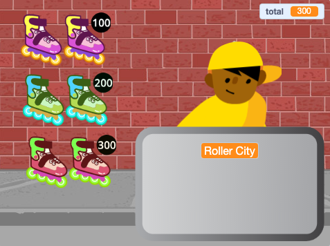
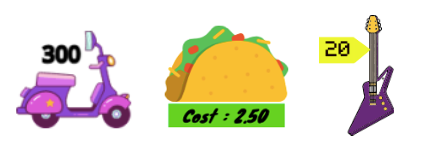

## Itens à venda

<div style="display: flex; flex-wrap: wrap">
<div style="flex-basis: 200px; flex-grow: 1; margin-right: 15px;">
Sua loja precisa de itens para vender. Cada item terá um preço que será adicionado a uma variável `total`{:class="block3variables"}.
</div>
<div>
{:width="300px"}
</div>
</div>

Você precisará acompanhar quanto seu cliente está gastando.

--- task ---

Adicione uma nova variável chamada `total`{:class="block3variables"} para todos os sprites.

Clique no sprite do seu **vendedor** e adicione um script para `definir`{:class="block3variables"} o `total`{:class="block3variables"} para `0` quando o projeto começa.

[[[scratch3-create-set-variable]]]

--- /task ---

Quais **itens** seus clientes comprarão?
+ Algum tipo de comida ou bebida
+ Equipamentos esportivos, brinquedos ou bugigangas
+ Varinhas mágicas, poções ou livros de feitiços
+ Roupas ou outros itens de moda
+ Your own idea

--- task ---

Adicione um sprite para o primeiro **item** que você venderá em sua loja.

Se desejar, você pode adicionar um preço à fantasia usando a ferramenta de texto do editor Paint. Ou adicione um preço ao fundo e posicione o item próximo a ele.



--- /task ---

--- task ---

Adicione um script para `alterar`{:class="block3variables"} o `total`{:class="block3variables"} pelo preço do seu item quando o cliente clica no sprite.

--- collapse ---
---
title: Click to add an item
---

```blocks3
when this sprite clicked
start sound (Coin v)
change [total v] by [10]
```

--- /collapse ---

Também é uma boa ideia `reproduzir um som`{:class="block3sound"} para dar ao cliente feedback de que ele adicionou um item.


[[[scratch3-add-sound]]]

--- /task ---

--- task ---

**Teste:** Clique no seu item e verifique se o valor da variável `total`{:class="block3variables"} aumenta conforme o preço do item e você ouve o efeito sonoro. Clique mais vezes para ver o total subir.

Clique na bandeira verde para iniciar seu projeto e certifique-se de que o `total`{:class="block3variables"} comece em `0`.

--- /task ---

--- task ---

Adicione mais itens à sua loja.

Você também pode:
+ Duplicar o primeiro item e adicionar uma nova fantasia no editor Paint
+ Adicionar um sprite e arrastar o script `quando a flag é clicada`{:class="block3events"} do primeiro item para o seu novo item

Adicione uma etiqueta de preço à fantasia ou cenário, se estiver usando-os.

--- /task ---

--- task ---

Clique em seu novo sprite **Item** na lista de Sprites e clique na guia **Código**.

Altere o valor que `total`{:class="block3variables"} muda para o preço do seu novo item.

--- /task ---

--- task ---

**Teste:** Clique na bandeira verde para iniciar seu projeto e clique nos itens para adicioná-los. Verifique se o total aumenta na quantidade correta cada vez que você clica em um item.

Se você adicionou etiquetas de preço, certifique-se de que elas correspondam ao valor adicionado ao `total`{:class="block3variables"}, ou seus clientes ficarão confusos!

--- /task ---

--- task ---

**Debug:** Você pode encontrar alguns bugs em seu projeto que precisa corrigir. Aqui estão alguns bugs comuns.

--- collapse ---
---
title: The total doesn't go to 0 when I click the green flag
---

Verifique se você definiu o valor inicial da variável `total`{:class="block3variables"} no script `quando a bandeira foi clicada`{:class=" block3events"} em seu sprite **vendedor**.

--- /collapse ---

--- collapse ---
---
title: The total doesn't increase by the correct amount when I click on an item
---

Verifique se cada item tem um script `quando este sprite é clicado`{:class="block3events"} que altera o `total`{:class="block3variables"} pelo valor correto daquele item — você pode ter alterado o preço do sprite errado.

Verifique se você usou o bloco `alterar`{:class="block3variables"} e não o bloco `definir`{:class="block3variables"} para alterar o `total`{:class="block3variables"}. Você precisa usar `alterar`{:class="block3variables"} para adicionar o preço ao total, você não deseja definir o total para o preço do item que acabou de ser adicionado.

--- /collapse ---

--- /task ---

--- save ---
