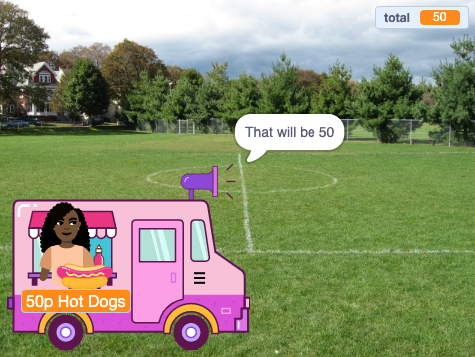

## Compras

<div style="display: flex; flex-wrap: wrap">
<div style="flex-basis: 200px; flex-grow: 1; margin-right: 15px;">

O sprite do **vendedor** precisa:
- perguntar se o cliente está pronto para pagar pelos itens
- receber o pagamento
- preparar-se para o próximo cliente
</div>
<div>
{:width="300px"}
</div>
</div>

Ao terminar de escolher os itens, o cliente clicará no sprite **vendedor** para pagar.

--- task ---

 Diga ao cliente quanto custarão seus itens.

```blocks3
when this sprite clicked
say (join [That will be ] (total)) for (2) seconds 
```

--- /task ---

--- task ---

Adicione um som de pagamento ao seu sprite **vendedor** para que o cliente saiba que o pagamento está sendo realizado.


[[[scratch3-add-sound]]]

Adicione o bloco `reproduzir som até terminar`{:class="block3sound"} ao seu script.

```blocks3
when this sprite clicked
say (join [That will be ] (total)) for (2) seconds
+ play sound [machine v] until done 
```

--- /task ---

--- task ---

Conclua a venda. Defina `total`{:class="block3variables"} de volta para `0` após o pagamento, `diga`{:class ="block3looks"} adeus e `transmita`{:class="block3control"} `próximo cliente`{:class="block3control"}.

```blocks3
when this sprite clicked
say (join [That will be ] (total)) for (2) seconds
play sound [machine v] until done 
+ set [total v] to (0)
+ say (join [Thanks for shopping at ] (name)) for (2) seconds
+ broadcast (next customer v)
```

--- /task ---

--- task ---

**Teste:** Teste seu projeto e certifique-se de:
- O cliente pode faz o check-out com os efeitos sonoros corretos
- O `total`{:class="block3variables"} volta para `0` depois que um cliente paga ou cancela.

--- /task ---


--- task ---

**Debug:** Você pode encontrar alguns bugs em seu projeto que precisa corrigir.

Aqui estão alguns bugs comuns:

--- collapse ---
---
title: The seller doesn't do anything when I click on them
---

Você tem bastante sprites em seu projeto. Certifique-se de que o script de `quando o sprite é clicado`{:class="block3events"} esteja em seu sprite **vendedor**.

**Dica:** Se você o adicionou ao sprite errado, você pode arrastar o código para o sprite do **vendedor** e excluí-lo do outro sprite.

--- /collapse ---

--- collapse ---
---
title: The words in the say blocks merge together
---

Quando você `junta`{:class="block3operators"} duas peças juntas, você precisa adicionar um espaço no final da primeira parte do texto ou no início da segunda parte do texto.

Esses possuem um espaço no final da primeira parte da junção:

```blocks3
say {join [That will be ](total)} for (2) seconds

say {join [Thanks for shopping at ](name)} for (2) seconds
```

--- /collapse ---

--- collapse ---
---
title: The total doesn't reset after a sale
---

Verifique se você usou:

```blocks3
set [total v] to (0)
```

**não**:

```blocks3
change [total v] by (0)
```

--- /collapse ---

--- collapse ---
---
title: The seller isn't responding
---

Certifique-se que o `operador`{:class="block3operators"} na condição `se`{:class="block3control"} é maior que o símbolo `>`{:class="block3operators"}.

```blocks3
if <(total) > [0]> then
```

--- /collapse ---

**Dica:** Compare seu código com os exemplos de código. Existem diferenças que não deveriam existir?

--- /task ---

--- save ---
