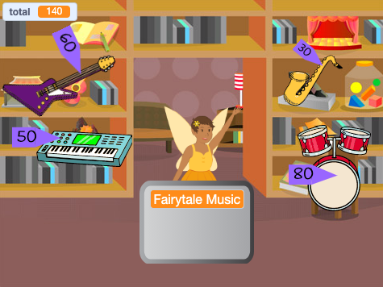

## Upgrade your project

If you have time you can upgrade your project.

{:width="300px"}

Here are some ideas you could try:
- Add more items to sell
- Add more graphic and sound effects
- Paint your own scenery and other costumes
- Make another business and allow players to visit them both

Each example project in the [Introduction](.) has a ‘See Inside’ link for you to open the project in Scratch, and look at the code to get ideas and see how they work.

Take a look at our ['Intergalactic shopping market'](https://scratch.mit.edu/studios/29662180){:target="_blank"} Scratch studio to see projects created by community members.

--- save ---
