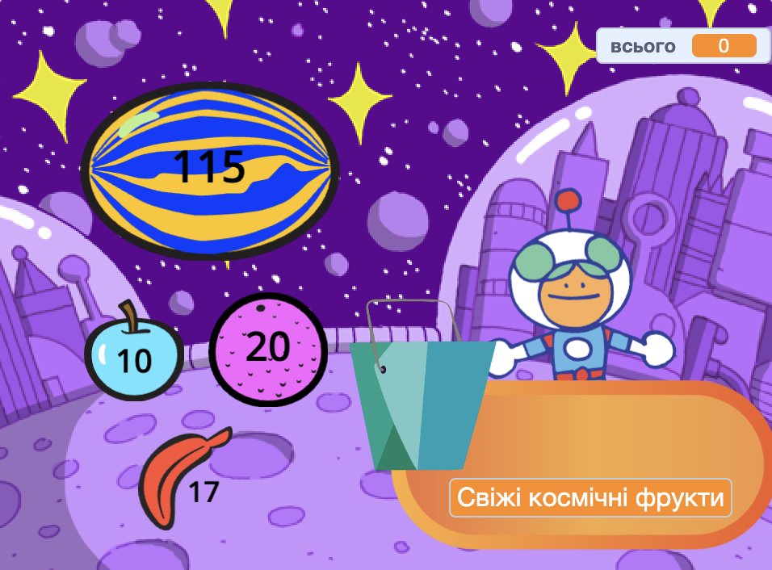
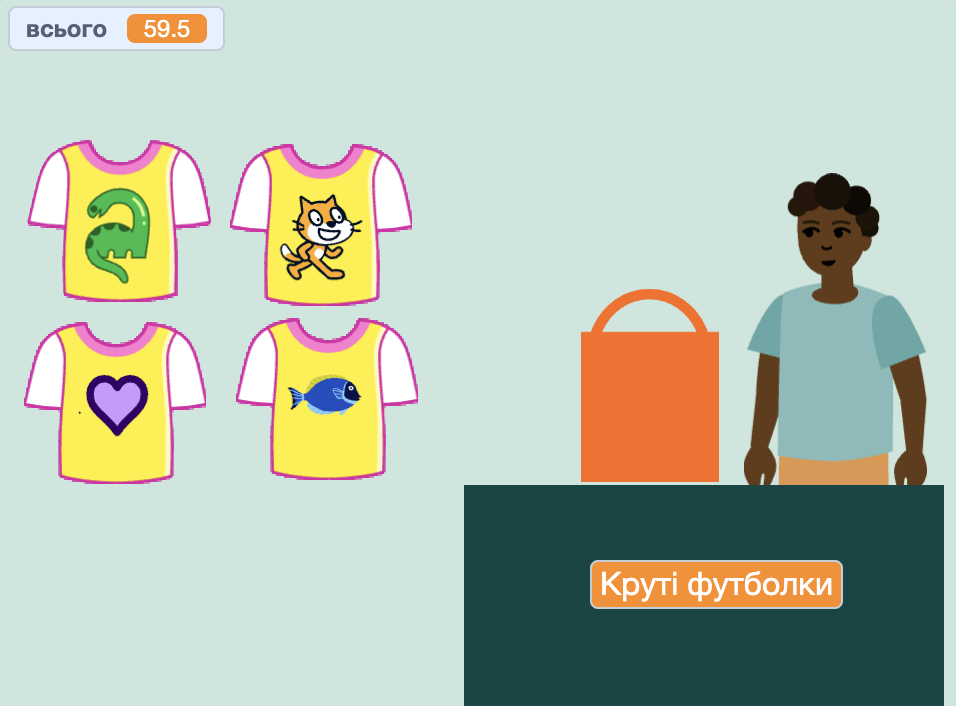
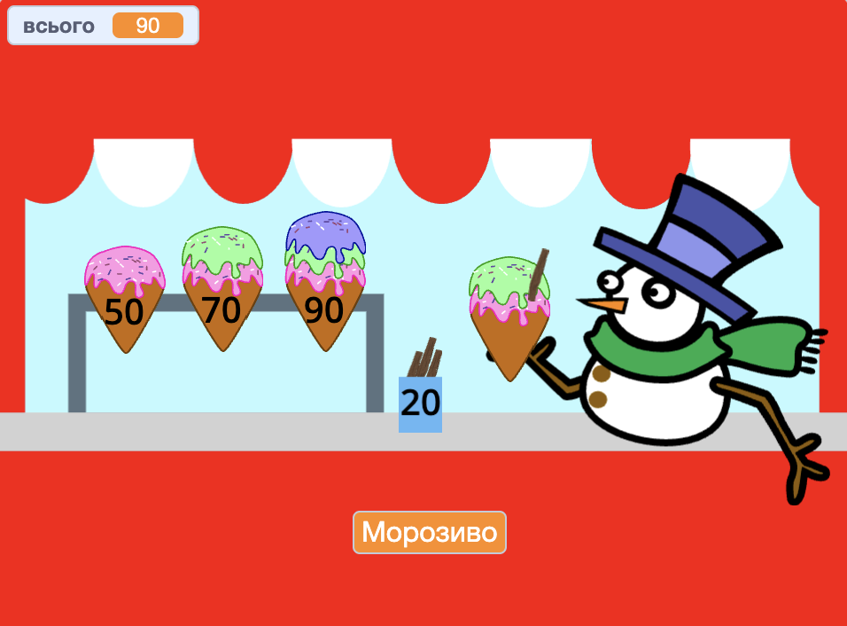
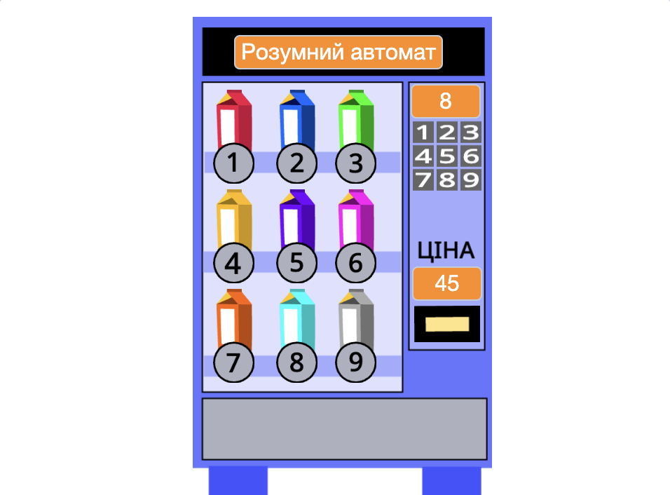

## Що ти зробиш

Створи застосунок-магазин, де покупці можуть купляти товари. Проєкт матиме вигляд від першої особи, де гравець буде покупцем.

--- no-print ---

Натискай на космічні фрукти і купляй їх. Зверни увагу, що загальна сума зростає. Вибери всі фрукти, які хочеш купити, а потім натисни на Кіран, щоб розрахуватися.

+ Що станеться, якщо ти спробуєш розрахуватися до того, як вибереш фрукт?
+ На твою думку, як проєкт дізнається, що ти ще не вибрав/-ла жодного фрукта?

**Свіжі космічні фрукти**: [Переглянути код](https://scratch.mit.edu/projects/1107251106/editor){:target="_blank"}

  <iframe allowtransparency="true" width="485" height="402" src="https://scratch.mit.edu/projects/embed/1107251106/?autostart=false" frameborder="0"></iframe>

### Отримай ідеї 💭

Натисни на спрайт **продавця**, щоб купити товари:

**Круті футболки**: [Переглянути код](https://scratch.mit.edu/projects/1107247335/editor){:target="_blank"}

  <iframe allowtransparency="true" width="485" height="402" src="https://scratch.mit.edu/projects/embed/1107247335/?autostart=false" frameborder="0"></iframe>

**Магазин морозива**: [Переглянути код](https://scratch.mit.edu/projects/1107253384/editor){:target="_blank"}

  <iframe allowtransparency="true" width="485" height="402" src="https://scratch.mit.edu/projects/embed/1107253384/?autostart=false" frameborder="0"></iframe>

**⭐ Значки прайду** (проєкт спільноти)

Натискай на значки прайду, щоб додати їх у свій кошик:

  <iframe allowtransparency="true" width="485" height="402" src="https://scratch.mit.edu/projects/embed/750787529/?autostart=false" frameborder="0"></iframe>

--- /no-print ---

--- print-only ---

### Отримай ідеї 💭

Ти матимеш прийняти дизайнерські рішення, щоб створити свого персонажа. Переглянь приклади проєктів у студії Скретч «Наступний покупець!» за адресою: https://scratch.mit.edu/studios/29611454

--- /print-only ---

