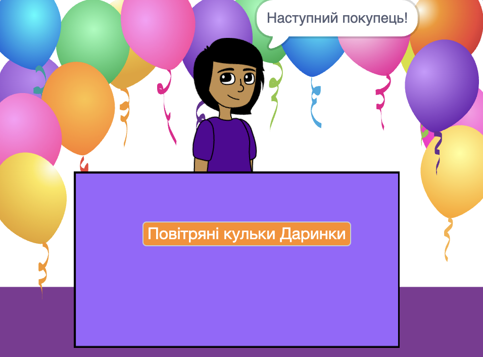

## Твій магазин

<div style="display: flex; flex-wrap: wrap">
<div style="flex-basis: 200px; flex-grow: 1; margin-right: 15px;">
Придумай ідею магазину. Це може бути щось реалістичне, щось із книги чи фільму, який тобі подобається, або щось абсолютно безглузде.
</div>
<div>
{:width="300px"}
</div>
</div>

--- task ---

Відкрий [новий проєкт Скретч](http://rpf.io/scratch-new){:target="_blank"} і переглянь варіанти спрайтів і тла, що можна використати. Витрать трохи часу на обмірковування ідеї свого магазину.

--- /task ---

--- task ---

Натисни **Обрати тло** або намалюй своє власне тло.


+ Тло з бібліотеки Скретч чи просте одноколірне тло

--- /task ---

--- task ---

Натисни **Обрати спрайт** та додай або намалюй додаткові спрайти для сцени.


--- /task ---

--- task ---

Додай більше декорацій.
+ Стіл, прилавок чи вікно, з якого можна продавати
+ Полиця чи книжкова шафа, на якій можна розмістити товар — це можна намалювати на тлі.

--- /task ---

--- task ---

Додай спрайт, який буде продавцем або продавчинею.

Ти можеш вибрати:
+ Особу чи неігрового персонажа, як-от власницю крамниці, фермера чи бібліотекарку
+ Апарат, як-от торговельний автомат, музичний автомат чи касовий апарат


--- /task ---

### Привітай свого першого покупця.

--- task ---

Натисни на спрайт**продавця** і додай блок `оповістити`{:class="block3control"}. Створи нове повідомлення під назвою `наступний покупець`.

```blocks3
when flag clicked
+ broadcast (новий покупець v)
```

--- /task ---

--- task ---

Створи новий скрипт для спрайту **продавця**, щоб він `говорив`{:class="block3looks"} `Прошу, наступний покупець!`, коли отримає `повідомлення`{:class="block3control"} `наступний клієнт`{:class="block3control"}.

```blocks3
when I receive [наступний покупець v] 
say [Наступний покупець!] for (2) seconds
```

--- /task ---

--- save ---
