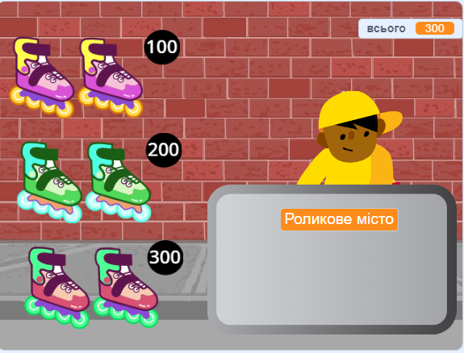
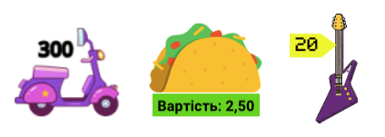

## Товари

<div style="display: flex; flex-wrap: wrap">
<div style="flex-basis: 200px; flex-grow: 1; margin-right: 15px;">
Твоєму магазину потрібні товари. Кожен товар матиме ціну, яка буде додана до змінної `всього`{:class="block3variables"}.
</div>
<div>
{:width="300px"}
</div>
</div>

Тобі потрібно буде стежити за тим, скільки витрачає покупець.

--- task ---

Додай нову змінну під назвою `всього`{:class="block3variables"} для всіх спрайтів.

Натисни спрайт **продавця** та додай скрипт, який `надасть`{:class="block3variables"} змінній `всього`{:class="block3variables"} значення `0` під час запуску проєкту.

[[[scratch3-create-set-variable]]]

--- /task ---

Які **товари** продаватиме твій магазин?
+ Продукти
+ Спортивне обладнання, іграшки чи гаджети
+ Чарівні палички, зілля або книги заклинань
+ Одяг або інші модні речі
+ Придумай щось своє

--- task ---

Додай спрайт для першого **товару**, який ти продаватимеш у своєму магазині.

За бажанням ти можеш додати ціну до образу спрайта за допомогою текстового інструменту в редакторі малювання. Або додай ціну на тло і розташуй товар поруч із нею.



--- /task ---

--- task ---

Додай скрипт, який `змінюватиме`{:class="block3variables"} значення змінної `всього`{:class="block3variables"} на ціну твого товару, коли покупець натискатиме на спрайт.

--- collapse ---
---
title: Додавання товару
---

```blocks3
when this sprite clicked
start sound (Coin v)
change [total v] by [10]
```

--- /collapse ---

Також можна `відтворити звук`{:class="block3sound"}, який повідомить покупцеві, що він додав товар у свій кошик.


[[[scratch3-add-sound]]]

--- /task ---

--- task ---

**Протестуй:** натисни на товар і перевір, чи значення змінної `всього`{:class="block3variables"} збільшиться на ціну товару і чи ти почуєш звуковий ефект. Натисни ще декілька разів і перевір, чи стає загальна сума ще більшою.

Натисни зелений прапорець, щоб запустити проєкт, і переконайся, що початкове значення змінної `всього`{:class="block3variables"} дорівнює `0`.

--- /task ---

--- task ---

Додай більше товарів до свого магазину.

Ти можеш:
+ або здублювати перший товар, а потім додати новий образ у редакторі малювання,
+ або додати спрайт, а потім перетягнути скрипт `коли зелений прапорець натиснуто`{:class="block3events"} з першого товару до нового товару.

Додай цінник до образу або на тло, якщо ти використовуєш цінники.

--- /task ---

--- task ---

Натисни на новий спрайт **товару** у списку спрайтів, а потім натисни вкладку **Код**.

Зміни величину, на яку збільшується значення змінної `всього`{:class="block3variables"}, на ціну нового товару.

--- /task ---

--- task ---

**Протестуй:** натисни на зелений прапорець, щоб запустити проєкт, і натисни на товари, щоб додати їх до кошика. Переконайся, що загальна сума збільшується на правильну величину кожного разу, коли ти натискаєш на товар.

Якщо ти використовуєш цінники, переконайся, що вони відповідають величині, яка додається до значення змінної `всього`{:class="block3variables"}, інакше покупці розгубляться!

--- /task ---

--- task ---

**Налагодження:** Можливо, у твоєму проєкті знайдуться помилки, які потрібно буде виправити. Ось деякі поширені помилки.

--- collapse ---
---
title: Сума не перетворюється на 0, коли я натискаю зелений прапорець
---

Переконайся, що ти встановив/-ла початкове значення змінної `всього`{:class="block3variables"} у скрипті `коли зелений прапорець натиснуто`{:class=" block3events"} у спрайті **продавця**.

--- /collapse ---

--- collapse ---
---
title: Сума збільшується на неправильну величину, коли я натискаю на товар
---

Переконайся, що кожен товар має скрипт `коли спрайт натиснуто`{:class="block3events"}, який змінює значення змінної `всього`{:class="block3variables"} на правильну суму для цього товару — можливо, ти змінив/-ла ціну в іншому спрайті.

Переконайся, що ти використовуєш блок `змінити`{:class="block3variables"}, а не блок `надати значення`{:class="block3variables"} для зміни значення `всього`{:class="block3variables"}. Використовуй блок `змінити`{:class="block3variables"}, щоб додати ціну до загальної суми. Інакше сумі буде надаватися значення ціни щойно доданого товару.

--- /collapse ---

--- /task ---

--- save ---
