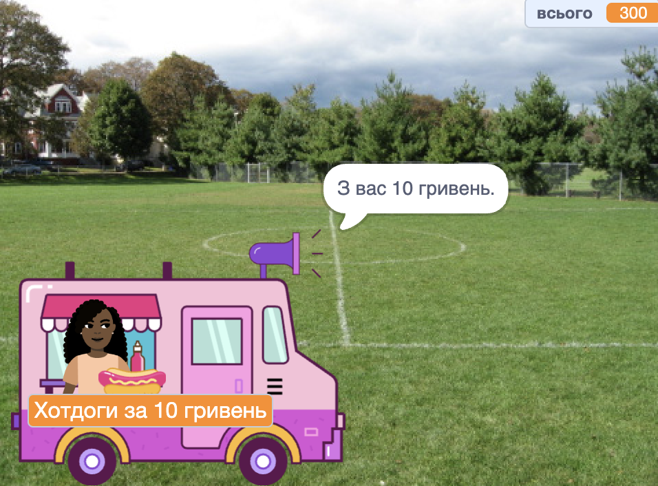

## Купівля

<div style="display: flex; flex-wrap: wrap">
<div style="flex-basis: 200px; flex-grow: 1; margin-right: 15px;">

Спрайт **продавець** має:
- запитати, чи готовий покупець розрахуватися за товари,
- прийняти платіж,
- підготуватися до наступного покупця.
</div>
<div>
{:width="300px"}
</div>
</div>

Завершивши вибір товарів, покупець натисне спрайт **продавця** для оплати.

--- task ---

 Скажи покупцю, скільки коштуватимуть його товари.

```blocks3
when this sprite clicked
say (join [That will be ] (total)) for (2) seconds 
```

--- /task ---

--- task ---

Додай звук платежу до спрайта **продавця**, щоб покупець знав, що відбувається платіж.


[[[scratch3-add-sound]]]

Додай до свого скрипту `відтворити звук до кінця`{:class="block3sound"}.

```blocks3
when this sprite clicked
say (join [That will be ] (total)) for (2) seconds
+ play sound [machine v] until done 
```

--- /task ---

--- task ---

Заверши продаж. Знову надай змінній `всього`{:class="block3variables"} значення `0` після оплати, `скажи`{:class ="block3looks"} «до побачення» та передай `повідомлення`{:class="block3control"} `наступний покупець`{:class="block3control"}.

```blocks3
when this sprite clicked
say (join [That will be ] (total)) for (2) seconds
play sound [machine v] until done 
+ set [total v] to (0)
+ say (join [Thanks for shopping at ] (name)) for (2) seconds
+ broadcast (next customer v)
```

--- /task ---

--- task ---

**Протестуй:** перевір свій проєкт і переконайся, що:
- Покупець може зробити покупку з правильними звуковими ефектами.
- Змінна `всього`{:class="block3variables"} знову стає `0` після того, як покупець сплачує або скасовує купівлю.

--- /task ---


--- task ---

**Налагодження:** можливо, у твоєму проєкті знайдуться помилки, які потрібно буде виправити.

Ось деякі поширені помилки:

--- collapse ---
---
title: Продавець нічого не робить, коли я натискаю на нього
---

У твоєму проєкті досить багато спрайтів. Переконайся, що у спрайті **продавця** є скрипт `коли спрайт натиснуто`{:class="block3events"}.

**Порада:** якщо ти додав/-ла код до неправильного спрайта, ти можеш перетягнути код до спрайта **продавця**, а потім видалити його з іншого спрайта.

--- /collapse ---

--- collapse ---
---
title: Слова у блоках «говорити» зливаються
---

Коли ти `з’єднуєш`{:class="block3operators"} два фрагменти, тобі потрібно додати пробіл у кінці першого або на початку другого фрагмента тексту.

Ці речення мають пробіл у кінці першої частини:

```blocks3
say {join [That will be ](total)} for (2) seconds

say {join [Thanks for shopping at ](name)} for (2) seconds
```

--- /collapse ---

--- collapse ---
---
title: Загальна сума не скидається після купівлі
---

Перевір, чи в тебе використано:

```blocks3
set [total v] to (0)
```

**а не**:

```blocks3
change [total v] by (0)
```

--- /collapse ---

--- collapse ---
---
title: Продавець не відповідає
---

Переконайся, що `оператором`{:class="block3operators"} в умові `якщо`{:class="block3control"} є знак «більше ніж» `>`{:class="block3operators"}.

```blocks3
if <(total) > [0]> then
```

--- /collapse ---

**Порада:** порівняй свій код із прикладами. Чи є там відмінності, яких не повинно бути?

--- /task ---

--- save ---
