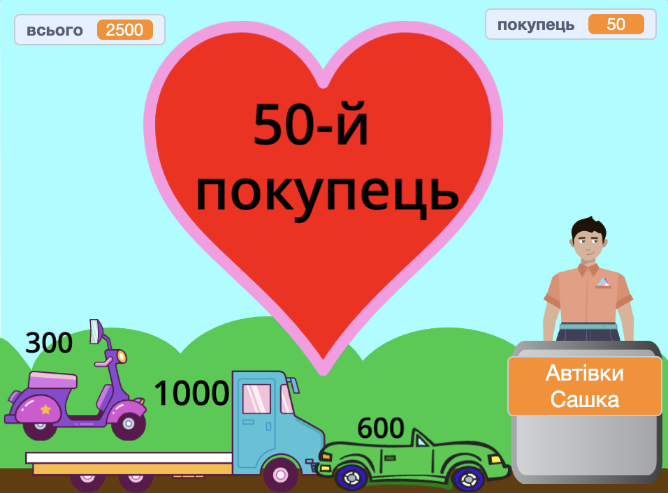

## Додаткове завдання

<div style="display: flex; flex-wrap: wrap">
<div style="flex-basis: 200px; flex-grow: 1; margin-right: 15px;">
Ти можеш додати безліч функцій, щоб покращити процес для покупців. Тобі не потрібно додавати все. Додай лише ті функції, які вважаєш важливими.
</div>
<div>
{:width="300px"}
</div>
</div>

--- task ---

Додай більше товарів до продажу.

--- /task ---

--- task ---

Додай більше графічних і звукових ефектів.

--- /task ---

--- task ---

Намалюй власні декорації та інші образи.

--- /task ---

--- task ---

Зроби ще один магазин і дозволь гравцям відвідувати обидва.

--- /task ---

Кожен приклад проєкту у [вступі](.) має посилання «Переглянути код», за яким ти можеш відкрити проєкт у Скретчі й переглянути код, щоб отримати ідеї та побачити, як вони працюють. Ти можеш «Переглянути код» проєктів-зразків, щоб побачити, як вони працюють.

Приклади проєктів:
**Свіжі космічні фрукти**: [Переглянути код](https://scratch.mit.edu/projects/1107251106/editor){:target="_blank"}
**Круті футболки**: [Переглянути код](https://scratch.mit.edu/projects/1107247335/editor){:target="_blank"}
**Магазин морозива**: [Переглянути код](https://scratch.mit.edu/projects/1107253384/editor){:target="_blank"}
**Торговий автомат**: [Переглянути код](https://scratch.mit.edu/projects/1107255779/editor){:target="_blank"}

**Порада:** якщо ти знаходишся в своєму обліковому записі Скретчу, ти можеш використовувати **Сховок**, щоб скопіювати скрипти або спрайти у свій проєкт.

[[[scratch-backpack]]]

### Побалакай з продавцем!

Продавець (або автомат) може спитати, чи сподобалось покупцю обслуговування чи як у нього справи.

--- task ---

Додай блоки `запитати`{:class="block3sensing"} до скрипта `коли спрайт натиснуто`{:class="block3events"} свого **продавця** і `говорити`{:class="block3looks"} різні речі залежно від відповіді покупців.

--- collapse ---

---

title: Став запитання та відповідай на них

---

```blocks3
ask [Ви знайшли все, що хотіли?] and wait
if <(answer) = [так]> then
say [Це чудово!] for [2] seconds
else
say [Можливо, мені варто додати більше товарів до свого магазину.] for [2] seconds
end
```

**Налагодження:** перевір, чи правильно у тебе написані параметри у коді та у відповіді. Можна використовувати великі літери, тоді «Так» і «ТАК» будуть збігатися з «так».

Додай кілька запитань, щоб створити чат-бота або неігрового персонажа, з яким можна спілкуватися.

--- /collapse ---

--- /task ---

### Поклади товари в сумку

--- task ---

У проєкті «Класні сорочки» товари перелітають у сумку.

--- collapse ---

---

title: Зроби так, щоб товари перелітали в контейнер

---

Додай спрайт-**контейнер**. Ти можете використати готовий спрайт, як-от **Gift** або спрайт **Take out**, або намалювати свій власний спрайт за допомогою простих фігур.

Додай скрипт, щоб **контейнер** завжди зображався зверху:

```blocks3
when flag clicked
forever
go to [передній v] layer
end
```

Тоді тобі потрібно буде додати код до кожного **товару**, щоб вони перелітали в контейнер, коли на них натискають:

```blocks3
when this sprite clicked
+go to [передній v] layer
+glide [1] secs to (Bag v) // використовуй назву свого спрайта-контейнера
+hide
change [всього v] by [12]
+go to x: [-180] y: [68] // початкова позиція
+show
```

Якщо ти не хочеш, щоб контейнер був там постійно, ти можеш додати скрипти, щоб він показувався й ховався у потрібний час:

```blocks3
when I receive [наступний покупець v]
hide // попередній покупець бере сумку
wait [1] seconds
show
```

**Протестуй:** запусти свій проєкт і переконайся, що товари перелітають до контейнера та ховаються.

**Налагодження:** ретельно перевір свої скрипти та переконайся, що всі спрайти **товарів** оновлено. Ти можеш переглянути проєкт [Класні сорочки](https://scratch.mit.edu/projects/1107247335/editor){:target="_blank"}, якщо тобі потрібно побачити робочий приклад.

--- /collapse ---

--- /task ---

###  Не дозволяй додавати товари, коли покупець на касі

--- task ---

Додай змінну `купівля`{:class="block3variables"}, щоб контролювати, коли можна додавати товари до кошика.

--- collapse ---

---
title: Не дозволяй додавати товари, коли покупець розраховується

---

Додай `змінну`{:class="block3variables"} під назвою `купівля` для всіх спрайтів. Ти встановиш значення `істина`, коли покупець у магазині, і `хиба`, коли покупець біля каси.

Вибери спрайт **продавця**. Онови скрипт `коли прапорець натиснуто`{:class="block3events"}, щоб дозволити купувати з початком проєкту:

```blocks3
+set [купівля v] to [істина]
```

Тепер додай блок, щоб змінити `купівля`{:class="block3variables"} на `хиба` на початку скрипту `коли спрайт натиснуто`{:class="block3events"} **продавця**:

```blocks3 
+set [купівля v] to [хиба]
```

Також додай блок, який поверне змінній `купівля`{:class="block3variables"} значення `істина` у кінці того самого скрипту:

```blocks3 
+set [купівля v] to [істина]
```

Тепер тобі потрібно оновити товари на продаж, щоб перевірити змінну `купівля`{:class="block3variables"}:

```blocks3
when this sprite clicked
+if <(купівля) = [істина]> then
start sound (Coin v)
change [всього v] by [10]
end
```
Тобі потрібно буде зробити це для кожного товару у магазині.

**Протестуй:** клацни зелений прапорець і спробуй купити щось. Переконайся, що ти все ще можеш додавати товари та розраховуватися, але не можеш додавати товари, коли ти вже на касі.

**Налагодження:** уважно перевір свій код. Ти можеш переглянути проєкт [Космічні фрукти](https://scratch.mit.edu/projects/1107251106/editor){:target="_blank"}, якщо тобі потрібно побачити робочий приклад.

--- /collapse ---

--- /task ---

--- task ---

### Дай покупцеві можливість скасувати купівлю.

--- collapse ---
---
title: Можливість скасування оплати
---

`Запитай`{:class="block3sensing"} `Бажаєте заплатити чи скасувати?`. Додай блок `якщо`{:class="block3control"} з умовою `відповідь`{:class="block3sensing"} `=`{:class="block3operators"} `оплатити` і всередині нього помісти свої наявні блоки оплати.

```blocks3
when this sprite clicked
say (join [З вас ] (всього)) for (2) seconds
+ ask [Бажаєте оплатити або скасувати купівлю?] and wait
+ if {(answer) = [оплатити]} then
play sound [machine v] until done 
set [всього v] to (0)
say (join [Дякуємо, що завітали в ] (назва)) for (2) seconds
broadcast [наступний покупець v]
end
```

Додай другий блок `якщо`{:class="block3control"} з умовою `відповідь`{:class="block3sensing"} `=`{:class="block3operators"} `скасувати` і всередині нього додай код для скасування купівлі.

```blocks3
when this sprite clicked
say (join [З вас ] (всього)) for (2) seconds
ask [Бажаєте оплатити або скасувати купівлю?] and wait
if {(answer) = [оплатити]} then
play sound [machine v] until done 
set [всього v] to (0)
say (join [Дякуємо, що завітали в ] (назва)) for (2) seconds
broadcast [наступний покупець v]
end
+ if {(answer) = [скасувати]} then
set [всього v] to (0)
say [Гаразд. Жодних проблем.] for (2) seconds
broadcast [наступний покупець v]
end
```

--- /collapse ---

--- /task ---

Відвідай нашу Скретч-студію [«Міжгалактичний торговий центр»](https://scratch.mit.edu/studios/29662180){:target="_blank"}, щоб побачити проєкти, створені членами спільноти.

--- save ---
