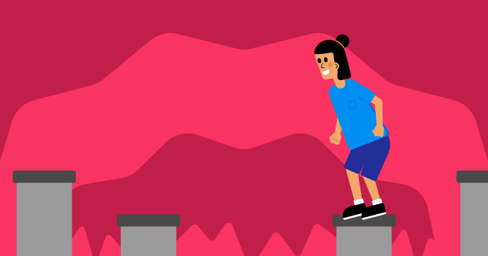

## Що далі?

Якщо ти йдеш напрямом [Більше Скретчу](https://projects.raspberrypi.org/uk-UA/raspberrypi/more-scratch), можеш переходити до наступного проєкту — [«Не впади»](https://projects.raspberrypi.org/uk-UA/projects/dont-fall-in). У цьому проєкті ти створиш гру із видом зверху вниз, де потрібно стрибати з платформи на платформу і не впасти.

--- print-only ---

--- /print-only ---

--- no-print ---

  <iframe allowtransparency="true" width="485" height="402" src="https://scratch.mit.edu/projects/embed/525202210/?autostart=false" frameborder="0"></iframe>

**Як грати:** для стрибка натисни <kbd>пробіл</kbd> або торкнися сцени.

--- /no-print ---

Якщо тобі подобається досліджувати Скретч, спробуй [ці проєкти](https://projects.raspberrypi.org/uk-UA/projects?software%5B%5D=scratch&curriculum%5B%5D=%201).

***

Цей проєкт переклали волонтери:

Yevgenia Lazuk

Завдяки волонтерам ми надаємо можливість людям у всьому світі навчатися рідною мовою. Ви також можете допомогти нам у цьому — більше інформації про волонтерську програму на [rpf.io/translate](https://rpf.io/translate).
